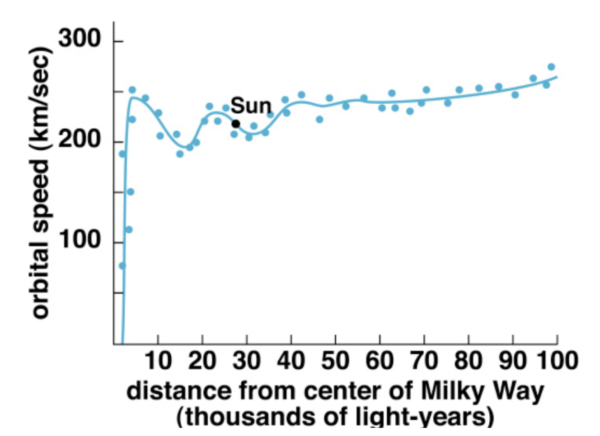
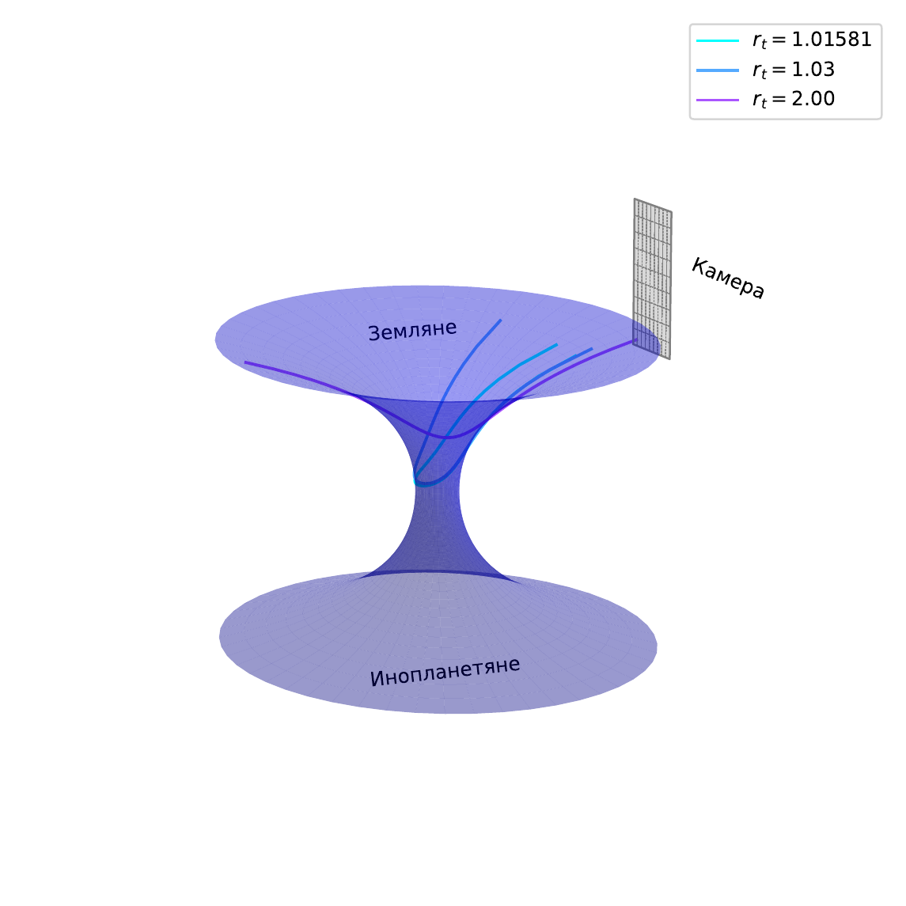
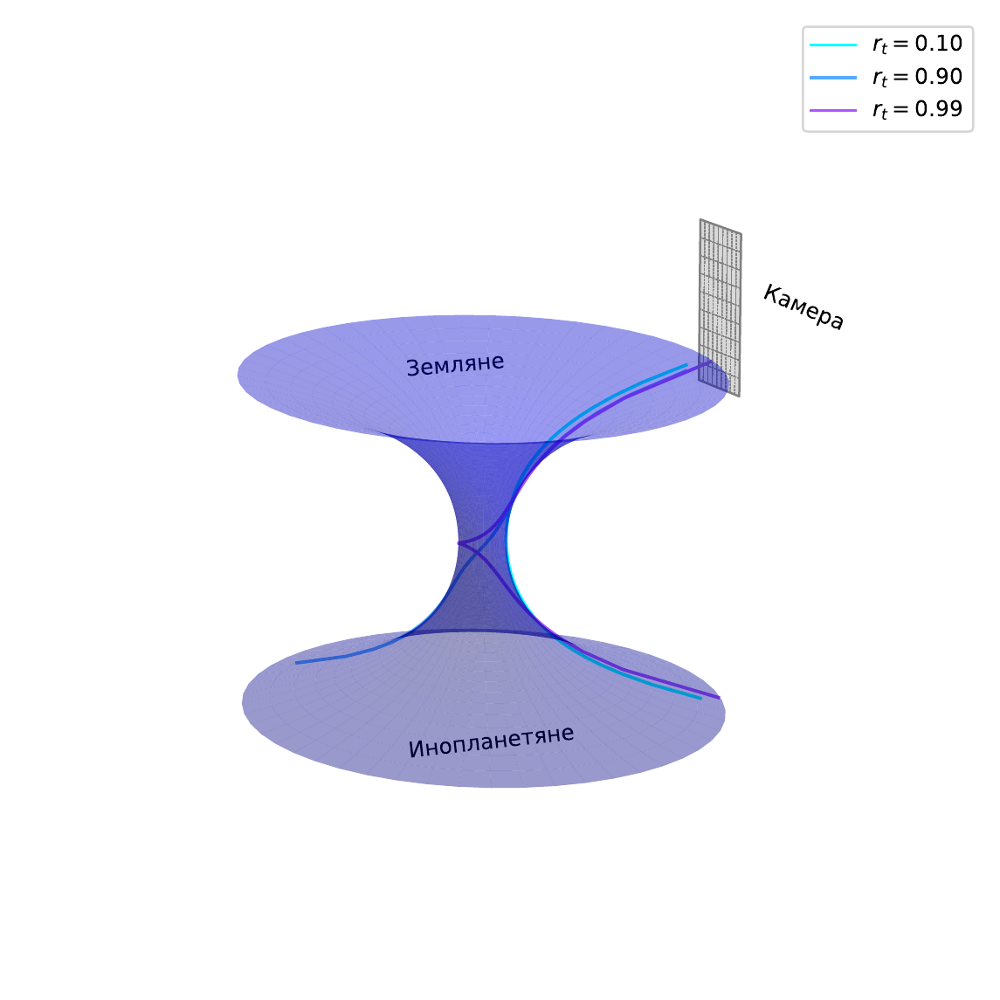
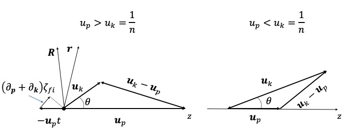

::: {.baikal-project-accordion}

  Project 1
  Spacetime Geometry and Observer Kinematics
  Prof. Emil Akhmedov

::: {.baikal-project-content}

1. Derive the metric as observed by a freely falling observer in the Schwarzschild spacetime. Provide a physical interpretation of the resulting metric. What does it reveal about the observer's experience of spacetime near and inside the event horizon?

2. Sketch the worldline of an eternally uniformly accelerating observer on the Penrose diagram of flat Minkowski spacetime. How does the diagram change if the acceleration occurs only for a finite duration? Identify and describe the regions of spacetime that are causally accessible to the observer in each case.

3. Explore a real-world analogue-gravity experiment that simulates features of curved spacetime or event horizons:

   - **BEC sonic horizon:** Review the experiment by [Steinhauer (2016)](https://doi.org/10.1038/nphys3863), which realizes a sonic black hole in a Bose-Einstein condensate. Describe how the experiment models Hawking radiation and how it relates to observer-dependent horizons.
   - **Optical event horizon:** Investigate the experiment by [Belgiorno et al. (2010)](https://doi.org/10.1103/PhysRevLett.105.203901), which demonstrates photon emission from an optical horizon in a nonlinear fiber. Discuss how soliton pulses mimic gravitational horizons.
   - **Water-tank analogy:** Study water-wave analogues of black holes as presented by [Weinfurtner et al. (2011)](https://doi.org/10.1103/PhysRevLett.106.021302). Analyze how surface-wave blocking models a horizon and how this affects signal propagation.
   - Optional: Reproduce part of the simulation or propose a simplified classroom demonstration based on one of these setups.

**Deliverables**

- Calculations and plots: derivations of coordinate transformations, Penrose diagram sketches, and causal-structure illustrations.
- Scientific report: a concise LaTeX-written report that includes full derivations, physical interpretations, and visualizations of the spacetime structure for freely falling and accelerating observers.
- Presentation: a 10-minute talk summarizing the observer-dependent geometry of Schwarzschild and Minkowski spacetimes.

:::

  Project 2
  Dark Matter in the Galaxy and Direct Detection
  Prof. Jianglai Liu

::: {.baikal-project-content}

1. The measured rotational curve of our galaxy is shown below. Assuming that the dark-matter halo dominates the entire galaxy and its distribution has spherical symmetry, determine the mass distribution function $M(r)$ of the dark-matter halo as a function of the distance $r$ to the Galactic center. What is the local dark-matter density, mass per unit volume, at the location of the Sun?

   {fig-alt="Observed rotational curve of the Milky Way Galaxy" width="70%"}

2. Based on the same rotation curve, assume that the dark-matter particle has a mass of $100\,\mathrm{GeV}/c^2$. Estimate the typical energy deposited when such a dark-matter particle elastically scatters off:

   - a xenon nucleus,
   - an argon nucleus,
   - an electron.

3. In liquid xenon detectors, nuclear recoil energy is subject to quenching and requires careful calibration. Design a neutron calibration experiment that produces xenon-nucleus recoil energies similar to those from dark-matter scattering. Estimate the typical kinetic energy of the neutrons required.

4. Assume a spin-independent elastic scattering cross section of $\sigma = 10^{-42}\,\mathrm{cm}^2$ and a dark-matter mass of $100\,\mathrm{GeV}/c^2$. How many dark-matter-nucleus scattering events are expected in a liquid xenon experiment with an exposure of $1\,\mathrm{ton}\cdot\mathrm{year}$, assuming a local dark-matter density of $\rho_\chi = 0.3\,\mathrm{GeV}/\mathrm{cm}^3$ and an average velocity $v \sim 220\,\mathrm{km/s}$?

5. Suppose a background-free experiment with a $1\,\mathrm{ton}\cdot\mathrm{year}$ exposure observes zero candidate events. What is the 90% confidence-level upper limit on the dark-matter-xenon nucleus scattering cross section?

6. Alternatively, consider an experiment where 9 events are observed with 9 expected background events. What is the 90% confidence-level upper limit on the signal rate? What is the corresponding upper limit on the dark-matter-xenon cross section?

**Deliverables**

- Calculations and plots: rotation-curve analysis, derived halo mass distribution, recoil-energy spectra for different targets, neutron-calibration energy estimates, and event-rate predictions.
- Scientific report: a concise LaTeX-written report detailing the theoretical derivations, numerical estimates, and implications for dark-matter detection.
- Presentation: a 10-minute talk summarizing the modeling of the Galactic halo, dark-matter detection principles, and experimental constraints.

:::

  Project 3
  Annihilating Dark Matter
  Sergey Zavyalov

::: {.baikal-project-content}

Dark matter (DM) is one possible extension of the Standard Model (SM). Existing SM particles cannot account for the required DM densities and masses. Robust astronomical evidence supports DM existence, including galactic rotation curves and gravitational lensing in colliding galaxy clusters, for example the Bullet Cluster. These observations motivate physics beyond the SM.

DM is classified as cold (CDM) or hot (HDM). CDM provides the best fit to observed large-scale structure and CMB data, with Weakly Interacting Massive Particles (WIMPs) and axions as leading candidates. Neutrinos can represent HDM but contribute negligibly to the total DM density because their masses and abundances are too small; they also suppress small-scale structure formation.

This project proposes a multi-messenger astronomy approach to probe DM signatures. The work will investigate:

1. sterile-neutrino decay into active neutrinos and photons,
2. CDM annihilation to photons and neutrinos,
3. a combined analysis of both channels.

**Tasks**

1. **Sterile neutrinos: theory**

   - Examine the seesaw mechanism for neutrino mass generation. Construct the most general one-flavor Yukawa Lagrangian including Dirac and Majorana mass terms. Demonstrate that the low-energy effective action reduces to a single dimension-5 operator, the Weinberg operator. Predict neutrino masses assuming a GUT scale of order $10^{15}\,\mathrm{GeV}$.
   - Analyze radiative neutrino decay, $\nu_2 \to \nu_1 + \gamma$, for Dirac and Majorana neutrinos. Draw the Feynman diagrams and derive decay widths for both cases. Provide numerical estimates.

2. **Sterile neutrinos: experiment**

   - Compile galactic X-ray data in the energy range relevant for sterile-neutrino decay. Model Galactic DM density profiles and subtract astrophysical foregrounds.
   - Isolate background and signal regions using established signal/background techniques. Extract signal photon spectra from sterile-neutrino decays.
   - Simulate a space telescope with characteristic energy resolution, efficiency, exposure, and field of view, based on existing observatories.
   - Constrain model parameters, including the neutrino mixing angle and sterile-neutrino mass, via likelihood maximization or an equivalent method. Compare the result with existing experimental limits.

3. **Annihilating cold dark matter: photons**

   - Compute expected photon spectra from CDM annihilation in the Galactic halo.
   - Repeat the analysis from task 2 to constrain the DM annihilation cross section and mass.

4. **Annihilating cold dark matter: neutrinos**

   - Compute expected neutrino spectra from CDM annihilation in the Sun's gravitational potential.
   - Repeat the analysis from task 2 using a simple neutrino-telescope model, based on IceCube, Baikal-GVD, or KM3NeT. Constrain the annihilation cross section and mass of CDM particles.
   - Perform a combined sensitivity analysis using photon and neutrino channels.

**Deliverables**

- Scientific report: a concise LaTeX report detailing methodology, results, uncertainties, and implications.
- Presentation: a 10-15 minute summary of the approach, constraints, and astrophysical implications.

:::

  Project 4
  The Detectability of Other Neutrino Sources Like NGC 1068
  Prof. Lili Yang

::: {.baikal-project-content}

**Introduction**

The IceCube experiment reported an excess of neutrinos associated with the nearby active galaxy NGC 1068 with a significance of $4.2\sigma$. NGC 1068 is the brightest and one of the closest Seyfert galaxies, and has been observed by various instruments. Multi-messenger observations can help clarify the mechanisms and production regions of neutrinos.

**Tasks**

1. **Build a numerical model**

   - Obtain the spectral energy distribution (SED) of NGC 1068, including electromagnetic radiation from radio to gamma-ray bands and neutrinos.
   - Model the SED with a reasonable setup and present the model parameters.

2. **Calculate neutrino flux**

   - Search for potential neutrino-candidate Seyfert galaxies located in the Southern Hemisphere and compare their physical properties.
   - Apply the constructed model to these selected sources and calculate their neutrino fluxes arriving at Earth.

3. **Estimate event rates**

   - Calculate the $\nu_\mu + \bar{\nu}_\mu$ event rates from these sources and the atmospheric background for KM3NeT.
   - Estimate the observation time needed to identify the sources with a significance of $5\sigma$.

4. **Study the impact of relevant factors**

   - Analyze how the effective area and angular resolution affect source detectability.
   - Analyze how source distance and luminosity affect detectability.

**Deliverables**

- Calculations and plots: SED and fitted model, predicted neutrino flux, event rates, and detectability of neutrino sources for different distances and luminosities.
- Scientific report: a concise LaTeX-written report presenting the source modeling, interpretation, results, and impact of detector parameters and source properties.
- Presentation: a 10-minute talk summarizing the constructed model and neutrino detectability.

:::

  Project 5
  High-Energy Astrophysical Neutrinos
  Vladimir Allakhverdian

::: {.baikal-project-content}

1. Assume the photon spectrum is given by

   $$
   \frac{dN}{dE} =
   A \cdot \frac{E^{-\gamma}}{1 + \tan\left(\frac{\pi E}{2E_{\mathrm{cut}}}\right)}.
   $$

   Determine, in the simplest approximation, the corresponding spectrum of muon neutrinos $\nu_\mu$, assuming the neutrinos originate from the reaction chain

   $$
   p + p \rightarrow \pi^\pm + \ldots \rightarrow \nu_\mu,\bar{\nu}_\mu,\ldots .
   $$

   Tip: estimate the average fraction of energy transferred from protons to neutrinos in these processes. It may be useful to treat the combined $\nu_\mu + \bar{\nu}_\mu$ flux rather than each separately. See, for example, arXiv:2212.11236.

2. Select a specific astrophysical source on the sky and determine the normalization constant $A$ using the luminosity of this source.

   If a specific source is difficult to work with, make a rough estimate by selecting a representative energy, for example 100 TeV, and comparing your model flux to IceCube measurements at that energy.

3. Compare your estimate of the diffuse neutrino flux with the experimental measurements from IceCube.

   Optional: plot the model proton and neutrino fluxes together with IceCube data points.

4. Treat $\gamma$ and $E_{\mathrm{cut}}$ as free parameters of the model. Using available data, determine the best-fit values.

   Use a chi-square goodness-of-fit test and display two-dimensional confidence contours for the parameters $(\gamma,E_{\mathrm{cut}})$ corresponding to $1\sigma$, $2\sigma$, and so on.

**Deliverables**

- Calculations and plots: derived neutrino spectrum, comparison with IceCube data, and overlaid fluxes for protons and neutrinos. If applicable, include best-fit parameter contours for $\gamma$ and $E_{\mathrm{cut}}$.
- Scientific report: a concise LaTeX-written report with all derivations, model assumptions, flux estimates, data comparison, and parameter-fit results.
- Presentation: a 10-minute talk summarizing the model setup, astrophysical motivation, numerical results, and comparison with observational data.

:::

  Project 6
  Stellar Evolution
  Vladimir Allakhverdian

::: {.baikal-project-content}

1. Write down the simplified system of equations governing stellar structure:

   - mechanical equilibrium,
   - equation of state,
   - energy transport,
   - energy generation,
   - mass conservation.

   Tip: choose a convenient radial variable - either radius or enclosed mass. Derive the mass-conservation law from the definition of a differential mass shell. The equation of state may be taken as an ideal gas plus radiation pressure. Mechanical equilibrium balances gravity and pressure gradients via Newton's second law. The remaining two equations follow from definitions of luminosity and specific energy generation per unit mass.

2. Specify appropriate boundary conditions at the center and surface of the star. At both boundaries, mass, radius, and luminosity are well-defined. At the surface, you may also impose a given stellar temperature.

3. Numerically solve the system and estimate the lifetime of the star as a function of its mass and luminosity.

   Optional: plot stellar lifetime as a function of mass and luminosity on a 2D diagram. Estimate the main-sequence lifetime of the Sun from this plot.

**Deliverables**

- Calculations and plots: complete derivation of the stellar-structure equations, boundary-condition formulation, and numerical solutions for stellar lifetime. Include plots showing lifetime as a function of mass and luminosity, and mark the Sun on the diagram.
- Scientific report: a concise LaTeX-written report presenting the assumptions, model equations, numerical scheme, and physical interpretation of results.
- Presentation: a 10-minute talk summarizing the equations, boundary conditions, numerical solutions, and main physical insights about stellar evolution.

:::

  Project 7
  Possible Location of Neutrinos in Blazars Based on Core-Shift Measurements
  Prof. Elena Nokhrina

::: {.baikal-project-content}

**Tasks**

1. **Sample construction:** Compile a sample of bright blazars - possible neutrino sources - with measured core shift, viewing angle, and apparent speed.

2. **Estimates of flare delays between 11 and 22 GHz cores:**

   - Based on two models for a core-shift index, calculate an expected time delay between 11 and 22 GHz cores.
   - Compare it with the observed median delay for suspected neutrino sources.

3. **Discuss possible reasons for discrepancies:**

   - The neutrino source is upstream of the 22 GHz core.
   - Flare speed differs from the kinematic speed estimate of bright components.
   - The viewing-angle estimate has significant uncertainty.

4. **Physical conditions in a region of neutrino origin:** Estimate, where possible, the emitting-plasma number density and magnetic field in a potential region of neutrino origin.

**Deliverables**

- Results: a well-organized table with source properties and derived values.
- Scientific report: a concise LaTeX-written report summarizing sample construction, assumptions, results, and conclusions.
- Presentation: a short presentation on methods and results.

:::

  Project 8
  Neutrino Oscillation in Matter
  Vladimir Allakhverdian

::: {.baikal-project-content}

1. Consider a two-flavor approximation for neutrino oscillations. Write down the evolution equation for the neutrino state vector in matter.

   Hint: express the neutrino as a two-component vector in the flavor basis. Write the total Hamiltonian including both vacuum oscillations and the effective potential due to interactions with matter. Remember that you have two natural bases: the mass basis, diagonal in energy, and the flavor basis, diagonal in the interaction Hamiltonian.

2. Specify a model for the solar density profile.

   Options:

   - Fit a simple exponential form $\rho(r)=A\exp(-r/r_0)$ to published solar data.
   - Use a best-fit model, for example NASA's Standard Solar Model or tabulated profiles from [Bahcall (1989)](https://doi.org/10.1063/1.47008).

   Plot several density models and discuss their differences. You will use them in your numerical simulation.

3. Assuming electron neutrinos are produced in the solar core, determine their quantum state upon reaching the solar surface.

   Compute or numerically integrate the evolution matrix. Apply it to an initial pure $\nu_e$ state at the solar center.

4. Estimate the survival probability of electron neutrinos as a function of their energy.

   Use values of $\delta m^2_{12}$ and the mixing angle from the Particle Data Group. Compare survival probabilities for different solar density models. Plot $P_{ee}(E)$.

**Deliverables**

- Calculations and plots: Hamiltonian in matter, density-profile models, numerical evolution of the neutrino state, and survival probability as a function of energy. Include comparisons of different solar density models.
- Scientific report: a concise LaTeX-written report detailing the theory, derivation, modeling assumptions, and numerical results.
- Presentation: a 10-minute talk presenting the oscillation mechanism in matter, model comparisons, and survival-probability predictions relevant to solar neutrino experiments.

:::

  Project 9
  Hawking Radiation and Primordial Black Holes
  Prof. Dmitry Naumov

::: {.baikal-project-content}

1. In the Hawking-radiation model, a black hole loses energy by emitting photons. Bekenstein and Hawking derived an estimate for the power of this radiation:

   $$
   P = \frac{\hbar c^6}{15360\pi G^2M^2} = \frac{dMc^2}{dt}.
   $$

   Estimate the total evaporation time $t$ of a black hole as a function of its initial mass $M$. Compute $t$ for:

   - $M = 2\cdot10^{30}\,\mathrm{kg}$, the mass of the Sun,
   - $M = 10^{11}\,\mathrm{kg}$.

   Compare your results with the current age of the Universe, $1.4\cdot10^{10}$ years.

2. Suppose a microscopic black hole is produced in a proton-proton collision at the LHC with energy 13 TeV. Estimate its lifetime due to Hawking evaporation. Would it have time to grow by absorbing surrounding matter, for example Earth?

3. From task 1, the evaporation time of a black hole with $M=10^{11}\,\mathrm{kg}$ is comparable to the age of the Universe. Some astronomers search for such evaporating primordial black holes. However, the Universe is filled with cosmic microwave background radiation at temperature $T=2.7\,\mathrm{K}$. For a black hole to evaporate, its Hawking temperature $T_H$ must exceed 2.7 K. The temperature of a black hole is

   $$
   T_H = \frac{\hbar c^3}{8\pi GMk_B}.
   $$

   Estimate the maximum mass a black hole can have and still evaporate in the presence of the cosmic microwave background. What observational consequences might this have?

**Deliverables**

- Calculations and plots: black-hole lifetime as a function of mass, Hawking temperature versus mass, and comparison with the age and temperature of the Universe. Include estimates for specific cases and plots illustrating thresholds for evaporation.
- Scientific report: a concise LaTeX-written report explaining the Hawking-radiation mechanism, derived expressions, evaporation conditions, and implications for primordial black holes as observable phenomena.
- Presentation: a 10-minute talk summarizing the key physics of black-hole evaporation, lifetime estimates, cosmological relevance, and potential observational signatures.

:::

  Project 10
  Particle Acceleration at Astrophysical Shocks
  Prof. Evgeny Derishev

::: {.baikal-project-content}

1. Consider a strong shock wave propagating into a medium with a known equation of state. Under the assumption that the upstream pressure is negligible, solve the conservation equations for mass, momentum, and energy across the shock front. Determine the velocity of the downstream flow relative to the shock.

2. Develop a numerical code to simulate the trajectory of a test particle undergoing random scattering near the shock. Model the system by dividing space into upstream and downstream regions, each with different bulk velocities. Implement the following assumptions:

   - The scattering probability per unit time is a specified function of the particle's position.
   - Each scattering is isotropic in the rest frame of the local fluid.
   - The simulation ends when the particle travels sufficiently far into the downstream region.

3. Run the simulation multiple times with varied initial conditions for the particle's position and velocity. Accumulate statistics over a large number of simulated particles.

4. Using the statistical data obtained:

   - calculate the average rate of energy gain per scattering cycle,
   - compute the energy distribution of particles escaping downstream,
   - compare your results to expectations from first-order Fermi acceleration theory.

**Deliverables**

- Calculations and plots: shock jump conditions, downstream velocity estimates, particle trajectories, energy gain per cycle, and final energy distributions. Include comparisons with theoretical predictions of Fermi acceleration.
- Scientific report: a concise LaTeX-written report describing the physical model, derivations, numerical simulation methods, statistical results, and their interpretation in the context of shock-acceleration theory.
- Presentation: a 10-minute talk outlining the acceleration mechanism, simulation setup, key results, and comparison to Fermi-acceleration expectations.

:::

  Project 11
  How to Observe a Wormhole
  Prof. Dmitry Naumov

::: {.baikal-project-content}

1. To understand how a wormhole distorts visual perception, place a virtual camera near its throat and analyze the light rays reaching it. There are exactly two classes of photon trajectories:

   - *regular geodesics*, which remain in our Universe, the upper half of the wormhole surface;
   - *singular geodesics*, which pass through the wormhole and come from the other Universe, the lower half.

   These trajectories can be found by solving the geodesic equation in General Relativity:

   $$
   \frac{d^2x^\mu}{ds^2}
   + \Gamma^\mu_{\alpha\beta}
   \frac{dx^\alpha}{ds}
   \frac{dx^\beta}{ds}
   = 0,
   $$

   where $s$ is the affine parameter and $\Gamma^\mu_{\alpha\beta}$ are the Christoffel symbols determined by the geometry. They encode how space curves and do not depend on the particle.

2. Due to azimuthal symmetry of the wormhole, derive the conserved angular momentum:

   $$
   V_\varphi = g_{\varphi\varphi}V^\varphi
   = r^2\frac{d\varphi}{ds} = L = \mathrm{const}.
   $$

3. Show that the squared norm of the velocity vector gives

   $$
   V_iV^i =
   g_{rr}\left(\frac{dr}{ds}\right)^2 + \frac{L^2}{r^2}
   = C^2 > 0,
   $$

   and derive the first-order differential equation for the radial coordinate:

   $$
   \left(\frac{dr}{ds}\right)^2 =
   \frac{1}{g_{rr}}\left(C^2-\frac{L^2}{r^2}\right).
   $$

   Define the turning point $r=r_t$ by the condition $dr/ds=0$, leading to

   $$
   r_t^2 = \frac{L^2}{C^2}.
   $$

   Change variables from $s$ to $\varphi$ and show that

   $$
   \left(\frac{dr}{d\varphi}\right)^2 =
   \frac{r^2}{g_{rr}}\left(\frac{r^2}{r_t^2}-1\right).
   $$

4. For a wormhole with metric coefficient $g_{rr}=\left(1-b^2/r^2\right)^{-1}$, derive the integral form of the geodesic trajectory:

   $$
   \varphi(r) =
   \int \frac{dr}{\sqrt{(r^2-b^2)\left(r^2/r_t^2-1\right)}}.
   $$

5. Obtain the **regular solution** in terms of Jacobi elliptic functions:

   $$
   r(\varphi)=r_t\cdot dc\left(\varphi,\frac{b^2}{r_t^2}\right),
   $$

   where $dc=dn/cn$, and $dn$ and $cn$ are Jacobi elliptic functions. The angular coordinate is $\varphi\in(-\varphi_r,\varphi_r)$, where $\varphi_r=K(b^2/r_t^2)$, and $K$ is the complete elliptic integral of the first kind.

6. Derive the **singular solution**:

   $$
   r(\varphi)=b\cdot dc\left(\frac{b\varphi}{r_t},\frac{r_t^2}{b^2}\right),
   $$

   with $\varphi\in(-\varphi_s,\varphi_s)$, where $\varphi_s=(r_t/b)K(r_t^2/b^2)$.

7. Plot both regular and singular geodesic trajectories. You should obtain visualizations similar to:

   {fig-alt="Regular geodesics near a wormhole for b equals 1" width="68%"}

   {fig-alt="Singular geodesics near a wormhole for b equals 1" width="68%"}

8. Simulate or visualize what the camera sees near the wormhole. As the camera moves around the throat, how does the apparent position and brightness of stars change?

   Optional: create an animation showing the starry sky as seen through a wormhole. Use ray tracing, distorted projection, or existing software tools such as Blender, Unity, Python with Matplotlib, or Manim. Try showing how regular and singular geodesics bring light from different regions of the sky into the camera.

9. Propose a conceptual experiment to detect a wormhole using imaging or lensing data. What specific observational signatures, for example Einstein rings, duplicated or inverted stars, or color shifts, could distinguish a wormhole from a black hole or a standard gravitational lens?

**Deliverables**

- Calculations and plots: geodesic equations and solutions, including analytic expressions and plotted regular/singular trajectories near the wormhole.
- Visualization or animation: a sketch or animated sequence, optional but encouraged, showing how the sky would appear to a camera near a wormhole, including effects of geodesic bending.
- Scientific report: a concise LaTeX-written report with derivations, trajectory analysis, visualization explanation, and a discussion of possible observational strategies for wormhole detection.
- Presentation: a 10-minute talk showcasing the physics of photon geodesics near wormholes, key visual effects, and proposed observational signatures.

:::

  Project 12
  Pulsar Wind Nebula Guitar and Its Environment
  Maxim Barkov

::: {.baikal-project-content}

The Guitar pulsar wind nebula contains a kinetic jet with emission extending up to about 10 keV. The goal of this project is to estimate the physical conditions around the nebula and build a simple physical scenario for the object.

**Tasks**

1. Collect the main observational facts about the Guitar pulsar wind nebula from the literature, including its distance, pulsar velocity, morphology, X-ray emission, and properties of the extended filament.

2. Estimate the magnetic-field strength in the surrounding interstellar medium. State clearly which observational quantities and physical assumptions enter the estimate.

3. Estimate the efficiency of particle acceleration in the nebula and in the kinetic jet. Compare the characteristic acceleration, cooling, and escape timescales for particles producing emission up to 10 keV.

4. Estimate the number and energy content of non-thermal particles in the filament. Discuss how the estimate depends on the assumed magnetic field, emitting volume, and radiation mechanism.

5. Propose a simple scenario for the object that connects the pulsar motion, the nebula, the filament, and the observed high-energy emission.

**Student should learn**

- How to work with scientific literature and extract the physical quantities needed for estimates.
- How to make simple order-of-magnitude physical estimates.
- How to construct a qualitative physical scenario for an astrophysical object.
- How to write a LaTeX-based scientific report.
- How to prepare a short oral talk and presentation.

**Deliverables**

- Literature summary: a short annotated list of the key papers and observational parameters used in the estimates.
- Calculations: estimates of the interstellar magnetic field, particle-acceleration efficiency, and number of non-thermal particles in the filament.
- Scenario: a concise physical interpretation of the Guitar nebula and its environment.
- Scientific report: a LaTeX-written report with assumptions, estimates, uncertainties, and conclusions.
- Presentation: a short oral talk summarizing the estimates and the proposed scenario.
:::

  Project 13
  Unveiling the Quantum Features of Cherenkov Emission: From Momentum Space to Phase Space
  Alexander Schepkin

::: {.baikal-project-content}

Classical Tamm-Frank theory describes Cherenkov radiation very successfully in the far field: it predicts the emission angle and spectral distribution. Standard quantum treatments usually work in momentum space, using scattering amplitudes and energy-momentum conservation. This project asks what is missed by that description when photon emission is treated as a finite space-time process with a formation length, flash duration, wave-packet spreading, and quantum coherence.

The goal is to use phase-space methods, especially the Wigner function, to describe Cherenkov photon emission locally in space and time while keeping quantum information about momenta and correlations.

Consider photon emission by a charged particle in a transparent medium,

$$
e \rightarrow e' + \gamma .
$$

The photon energy density can be represented through the electric and magnetic field amplitudes as

$$
W_r(\mathbf r,t)=
\int \frac{d^3k}{(2\pi)^3}\,W(\mathbf r,\mathbf k,t),
$$

where $W(\mathbf r,\mathbf k,t)$ is the photon Wigner function. For a particle described by a momentum-space wave function $f(\mathbf k)$,

$$
W(\mathbf r,\mathbf k,t)=
\int \frac{d^3\tilde k}{(2\pi)^3}
f^*_-(\mathbf k,\tilde{\mathbf k})f_+(\mathbf k,\tilde{\mathbf k})
\exp\{-it(\omega_+-\omega_-)+i\mathbf r\cdot\tilde{\mathbf k}\}.
$$

The incoming muon wave packet may be taken in a Gaussian form with fixed helicity and mean momentum $\langle\mathbf p\rangle$:

$$
f_e^{(\mathrm{in})}(\mathbf p,\lambda)
= \delta_{\lambda,\lambda_e}
\left(\frac{\sqrt{2\pi}}{\sigma}\right)^{3/2}
\exp\left[-\frac{(\mathbf p-\langle\mathbf p\rangle)^2}{2\sigma^2}\right].
$$

The detailed derivation leads to a master integral for the photon Wigner function. The project is to work through the mathematical steps that reveal the quantum structure of Cherenkov emission.

{fig-alt="Schematic illustration of plane-wave components in Cherenkov emission" width="82%"}

**Tasks**

1. **Integrate over the momentum $\tilde{\mathbf k}$.** Perform the Gaussian integral over $d^3\tilde k$ in the master expression for $W(\mathbf r,\mathbf k,t)$. Identify the vector $A_i$ and matrix $B_{ij}$ in the standard Gaussian integral formula, using the approximation

   $$
   \tilde{\mathbf k}\cdot\mathbf u_p \approx \tilde{\mathbf k}\cdot\mathbf u_k .
   $$

2. **Integrate over the time $\tau$.** After the $\tilde{\mathbf k}$ integration, evaluate the integral over $d\tau$ and obtain the spatial term depending on

   $$
   \mathbf R = \mathbf r-\mathbf u_p t + (\partial_p+\partial_k)\zeta_{fi}(\mathbf p,\lambda_e,\mathbf k,\lambda_\gamma),
   $$

   where $\zeta_{fi}=\arg M_{fi}$ is the phase of the emission amplitude.

3. **Extract the Gouy phase.** Write the pre-exponential factor in modulus-phase form,

   $$
   \frac{1}{\sqrt{G(t')}}\exp\left[-\frac{i}{2}g(t')\right],
   $$

   and show that the Gouy phase can be written as

   $$
   g(t')=g_1(t')+g_2(t')
   =\arctan\frac{t'}{t_d}+\arctan\frac{t'}{\tilde t_d}.
   $$

4. **Derive and plot the diffraction time.** Derive the explicit expression for the diffraction time $t_d$ in terms of $\sigma$, $\omega$, $n$, $\varepsilon$, $\mathbf u_p$, and $\mathbf u_k$. Write it as a function of the angle $\theta$ between $\mathbf u_p$ and $\mathbf u_k$. Plot $t_d(\theta)$ for two cases:

   - Cherenkov condition is met: $u_p>u_k$, for example $u_p=0.99$, $n=1.33$.
   - Cherenkov condition is not met: $u_p<u_k$, for example $u_p=0.6$, $n=1.33$.

   Use $\sigma=10^{-5}m_e$ and $\omega=10^{-5}m_e$. Discuss whether the behavior of $t_d(\theta)$ has unusual features.

5. **Analyze the diffraction-time behavior.** Find the extremum angle $\theta_{\mathrm{ext}}$ of $t_d(\theta)$ and calculate the value of $t_d$ at that point. Determine the two singular angles $\theta_1,\theta_2$ where $t_d\to\infty$, expand them to first order in $\omega/\varepsilon$, and estimate $|\theta_2-\theta_1|$ for optical photons, $\omega\sim1\,\mathrm{eV}$, and $\varepsilon\sim1\,\mathrm{MeV}$. Compare this with the photon emission angle obtained from energy-momentum conservation alone.

6. **Plot images of the photon Wigner function.** Numerically visualize the integral over the evolution time $t'$ as a function of $\mathbf R=(X,Y,Z)$ in the plane $Z=0$. Use

   $$
   \sigma=10^{-5}m_e,\quad \omega=10^{-5}m_e,\quad n=1.33,\quad
   \mathbf u_p=(0,0,0.99),\quad
   \mathbf u_k=(\sin\theta,0,\cos\theta).
   $$

   Study the Wigner-function formation by varying the integration limit $t_0$ from about $10^5t_c$ to $10^7t_c$, where $t_c=\hbar/(m_ec^2)\approx1.3\cdot10^{-21}\,\mathrm{s}$. Compare the behavior in three angular regions: $\theta<\theta_1$, $\theta_1\le\theta\le\theta_2$, and $\theta>\theta_2$. Analyze how the sign of the Wigner function at $\mathbf R=0$ correlates with the sign of the diffraction time $t_d$.

**Deliverables**

- Derivations: explicit expression for $t_d$; derivation of the extremum angle $\theta_{\mathrm{ext}}$ and singular angles $\theta_1,\theta_2$.
- Plots: $t_d(\theta)$ for the cases $u_p>u_k$ and $u_p<u_k$, with the classical Cherenkov angle and singular points marked; Wigner-function plots as functions of field formation time $t_0$ and angle $\theta$.
- Discussion: how quantum effects modify the classical picture of Cherenkov radiation; physical interpretation of singular angles and negative diffraction time; possible experimental signatures.
- Scientific report: a LaTeX-written report with derivations, numerical plots, and discussion.
- Presentation: a short talk explaining the phase-space picture and the main results.

**Reference**

- D. V. Karlovets et al., "Phase-space description of photon emission", *Physical Review A* **113**, 053722 (2026), [arXiv:2512.21783](https://doi.org/10.48550/arXiv.2512.21783).

:::

  Project 14
  SK-like Solar Neutrino Fit with Public Data
  Dmitry Naumov

::: {.baikal-project-content}

This data-driven project is based on the Solar Neutrino Masterclass. Students build a reproducible Super-Kamiokande-like solar-neutrino analysis using public tables and blinded pseudo-data.

**Materials**

- [Open the Solar Neutrino Masterclass](../neutrinophysics/solar-neutrino-masterclass/index.html)
- [Open the integrated project](../neutrinophysics/solar-neutrino-masterclass/assignments/sk_integrated_project.html)
- [Download the project data archive](../neutrinophysics/solar-neutrino-masterclass/data/project/solar_neutrino_project_data.zip)
- [Download masterclass 1 data](../neutrinophysics/solar-neutrino-masterclass/data/masterclass1/masterclass1_data.zip)
- [Download masterclass 2 data](../neutrinophysics/solar-neutrino-masterclass/data/masterclass2/masterclass2_data.zip)

**Goal**

Build one reproducible SK-like solar-neutrino analysis:

$$
{}^8\mathrm{B}\ \text{flux}
\to
P_{ee}(E_\nu)
\to
\nu e\ \text{scattering}
\to
\mu_j
\to
n_j
\to
\text{fit}.
$$

The final result is a fit of the blinded pseudo-data spectrum for

$$
\sin^2\theta_{12},
\qquad
\Delta m^2_{21}.
$$

The true values remain hidden until the project defense.

**Data included**

- Solar flux normalizations and neutrino spectra.
- Neutrino-electron recoil cross-section tables.
- A survival-probability grid in $(\sin^2\theta_{12},\Delta m^2_{21})$.
- Earth-regeneration tables and parameter scans.
- A blinded SK-like pseudo-data recoil spectrum.

**Tasks**

1. Reproduce the no-oscillation event-rate calculation and plot the ${}^8\mathrm{B}$ neutrino and recoil-electron spectra.
2. Add the survival-probability grid and compute the oscillated recoil spectrum.
3. Fit the blinded recoil spectrum in $\left(\sin^2\theta_{12},\Delta m^2_{21}\right)$ using a Poisson statistic.
4. Compute one-dimensional profiles and two-dimensional confidence contours.
5. Study Earth regeneration as an extension and estimate whether a day-night observable improves the fit.
6. Prepare short theory notes on the Gamow window, the astrophysical $S$ factor, neutrino-electron scattering, matter effects, profile likelihoods, and blind analysis.

**Deliverables**

- Reproducible notebook or script directory that reads the public data archive and reruns the full chain.
- Plots of spectra, survival probabilities, best-fit contours, and profile likelihoods.
- Frozen blinded-fit result to be compared with the unblinded point during the defense.
- Scientific report and short oral presentation.

:::

:::
