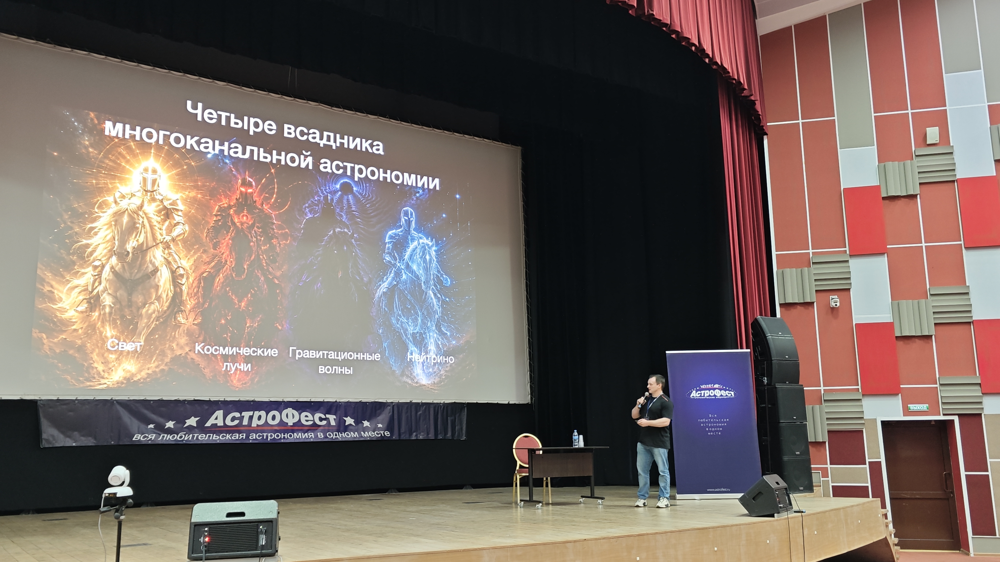
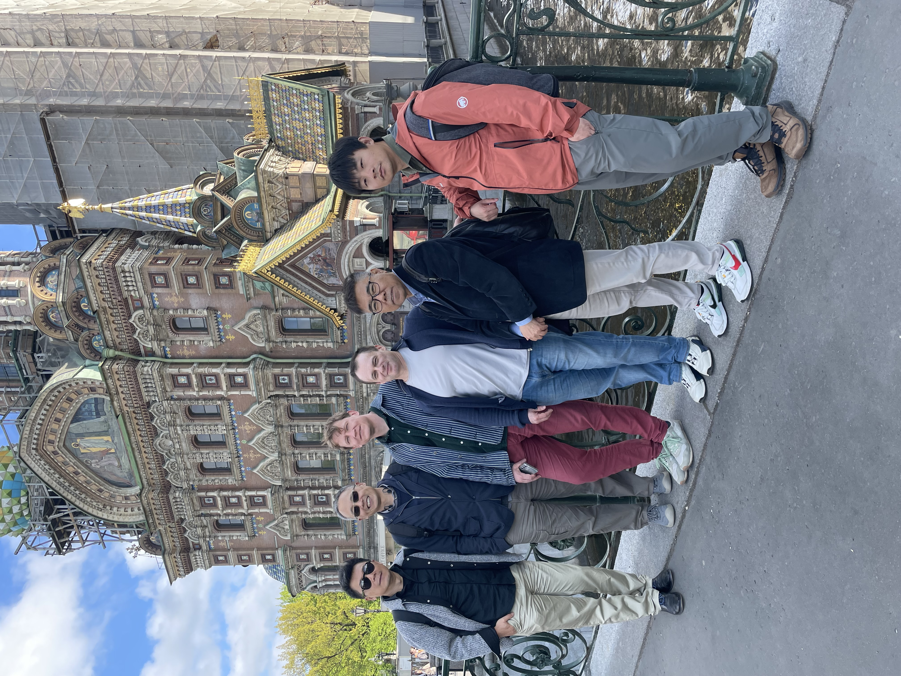
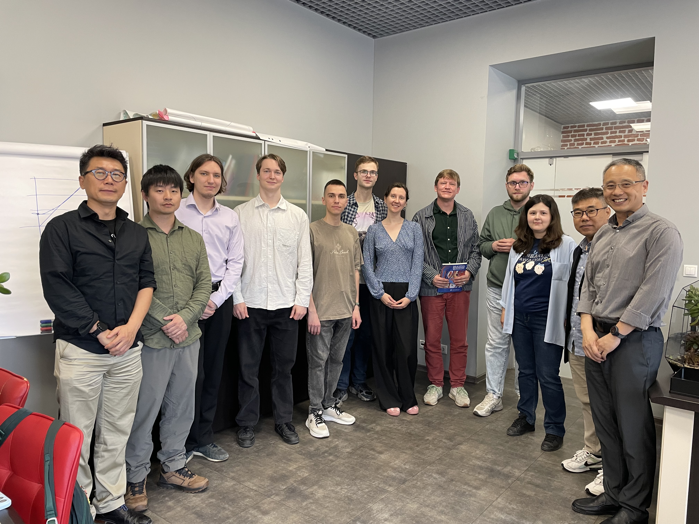
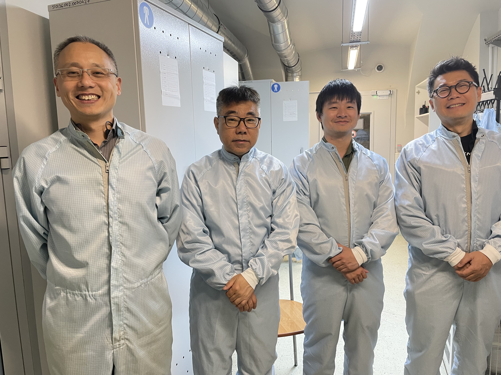
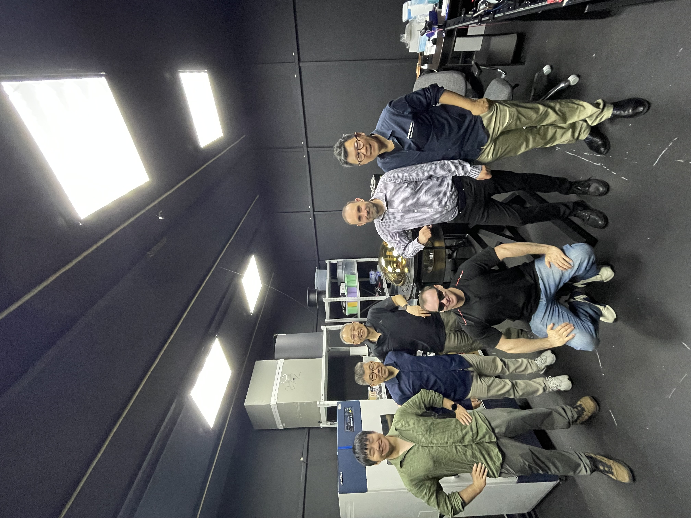
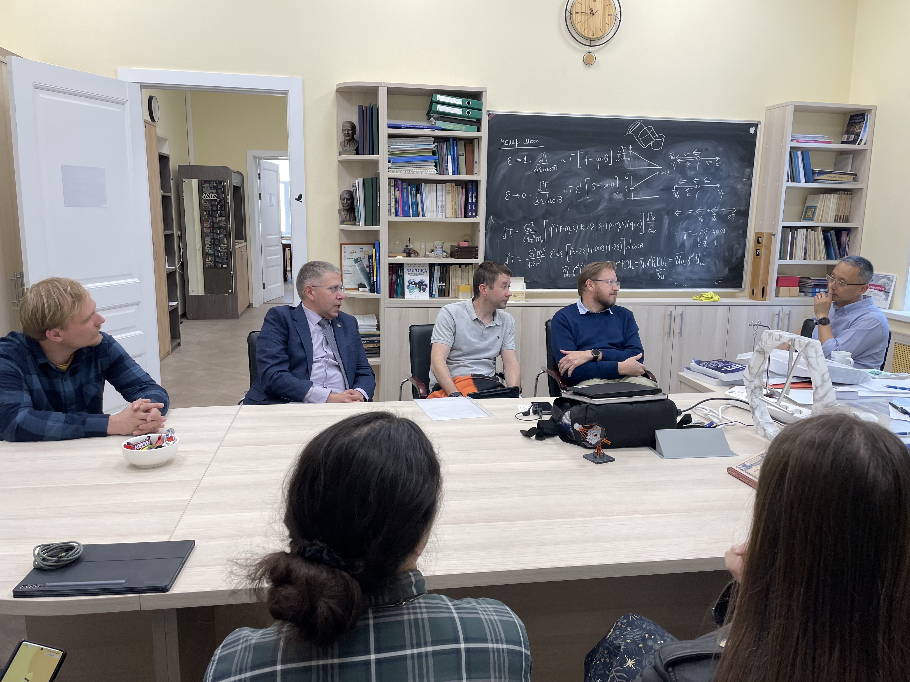

<figure class="published-photo">

<figcaption>Лекция &quot;Зачем нужны нейтринные телескопы?&quot;. Астрофест 2026</figcaption>
</figure>
<figure class="published-photo">

<figcaption>Лекция &quot;Зачем нужны нейтринные телескопы?&quot;. Астрофест 2026</figcaption>
</figure>
<figure class="published-photo">

</figure>
<figure class="published-photo">

</figure>
<figure class="published-photo">

</figure>
<figure class="published-photo">

</figure>
<figure class="published-photo">

</figure>
<figure class="published-photo">

</figure>
<figure class="published-photo">

</figure>
<figure class="published-photo">

</figure>

