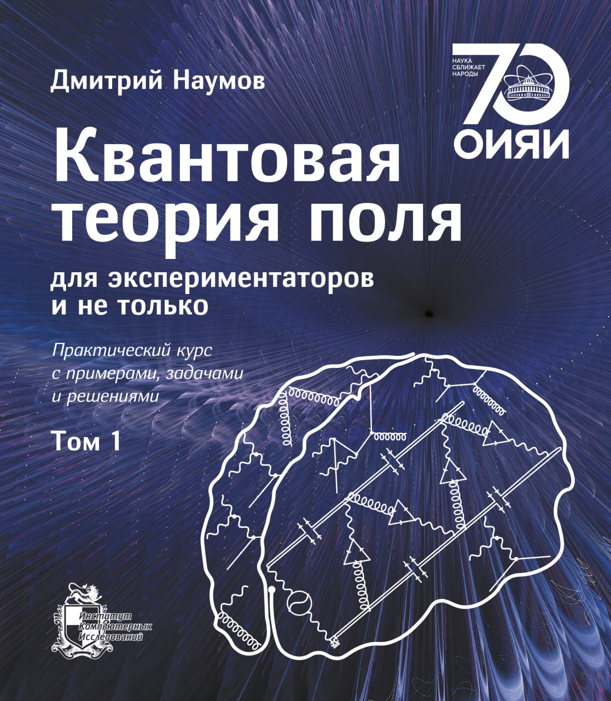
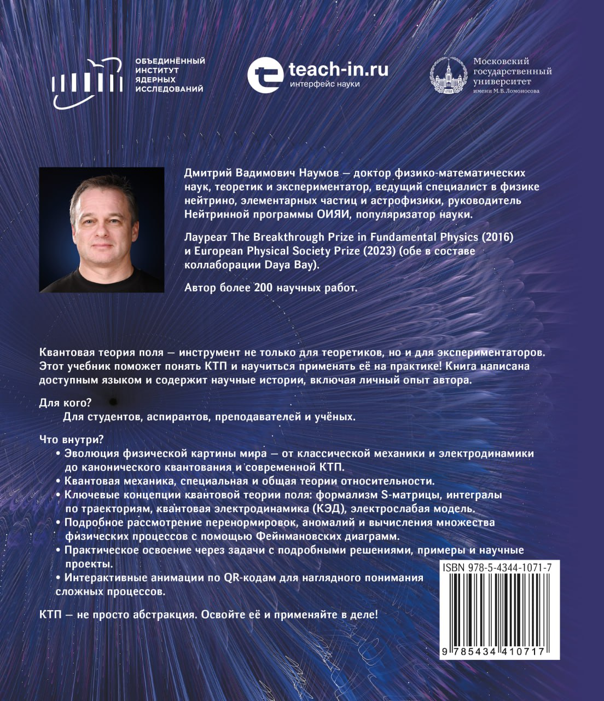

```{=html}
<div class="lecture-catalog">
  <p class="lecture-catalog-lead">
    Courses, educational programs, textbooks, and self-study materials. Russian-language materials are marked at the link level.
  </p>

  <section class="lecture-course-list" aria-label="Education sections">
    <details class="lecture-course program-course-teachin">
      <summary>
        <span class="lecture-course-status">Online program</span>
        <span class="lecture-course-title">Neutrino Physics and Astroparticle Physics</span>
      </summary>
      <div class="lecture-course-body education-program-detail">
        <div>
          <p>Teach-in educational program on neutrino physics and astroparticle physics. The program page and presentation are in Russian.</p>
          <dl class="education-program-meta">
            <dt>Program curator</dt>
            <dd>Nadezhda Kuznetsova</dd>
            <dt>Program director</dt>
            <dd>Dmitry Naumov</dd>
            <dt>Contact</dt>
            <dd><a href="mailto:fn@teach-in.ru">fn@teach-in.ru</a></dd>
          </dl>
          <div class="lecture-course-actions">
            <a class="lecture-action-primary" href="https://teach-in.ru/program">Open program (in Russian)</a>
            <a href="../assets/programs/teach-in-program.pdf">Presentation (Russian)</a>
            <a href="https://teach-in.ru/lecturer/naumov-dv">Lecturer profile (in Russian)</a>
          </div>
        </div>
        
        <figure class="education-program-map">
          <video controls muted playsinline preload="metadata" poster="../assets/programs/teach-in-applications-map-poster.jpg">
            <source src="../assets/programs/teach-in-applications-map.mp4" type="video/mp4">
          </video>
          <figcaption>Application geography by city</figcaption>
        </figure>
      </div>
    </details>
  </section>

  <h2 class="section-inline-title">Lecture Courses</h2>
  <section class="lecture-course-list" aria-label="Lecture catalog">
    <details id="qft" class="lecture-course lecture-course-qft">
      <summary>
        <span class="lecture-course-status">Published materials</span>
        <span class="lecture-course-title">Quantum Field Theory</span>
      </summary>
      <div class="lecture-course-body">
        <p>Courses on quantum field theory, the Standard Model, renormalization, accelerated frames, and selected QFT topics.</p>
        <div class="lecture-material-list">
          <details id="qft-textbook" class="lecture-material">
            <summary>Textbook</summary>
            <div class="lecture-material-body">
              <p><em>Quantum Field Theory for Experimentalists and More</em> is a two-volume textbook with examples, problems, and solutions. The Russian edition is published; the English edition is in preparation.</p>
              <div class="book-cover-spread" aria-label="Quantum field theory textbook cover">
                
                
              </div>
              <div class="lecture-material-list">
                <details class="lecture-material">
                  <summary>Russian print edition</summary>
                  <div class="lecture-material-body">
                    <div class="lecture-course-actions">
                      <a class="lecture-action-primary" href="https://shop.rcd.ru/catalog/fizika/20042/">Volume 1</a>
                      <a href="https://shop.rcd.ru/catalog/fizika/20097/">Volume 2</a>
                    </div>
                  </div>
                </details>
                <details class="lecture-material">
                  <summary>ROSPEX Publishing</summary>
                  <div class="lecture-material-body">
                    <div class="lecture-course-actions">
                      <a href="https://rospexpublishing.com/books/qft-volume-1.html?utm_source=neutrinohit&amp;utm_medium=website&amp;utm_campaign=qft_book">Volume 1</a>
                      <a href="https://rospexpublishing.com/books/qft-volume-2.html?utm_source=neutrinohit&amp;utm_medium=website&amp;utm_campaign=qft_book">Volume 2</a>
                      <a class="lecture-action-primary" href="https://rospexpublishing.com/books/qft-bundle.html?utm_source=neutrinohit&amp;utm_medium=website&amp;utm_campaign=qft_book">Bundle</a>
                    </div>
                  </div>
                </details>
                <details class="lecture-material">
                  <summary>Google Play Books</summary>
                  <div class="lecture-material-body">
                    <div class="lecture-course-actions">
                      <a class="lecture-action-primary" href="https://play.google.com/store/books/details?id=uLXTEQAAQBAJ">Volume 1</a>
                      <a href="https://play.google.com/store/books/details?id=KrbTEQAAQBAJ">Volume 2</a>
                    </div>
                  </div>
                </details>
                <details class="lecture-material">
                  <summary>English edition</summary>
                  <div class="lecture-material-body">
                    <p>In preparation.</p>
                  </div>
                </details>
              </div>
            </div>
          </details>
          <details id="qft-course" class="lecture-material">
            <summary>Lecture course “Quantum Field Theory”</summary>
            <div class="lecture-material-body">
              <p>Basic QFT course: notes and video recordings are in Russian.</p>
              <div class="lecture-course-actions">
                <a href="https://teach-in.ru/file/synopsis/pdf/quantum-field-theory-naumov-MKv0.pdf">Notes (Russian)</a>
                <a href="https://www.youtube.com/playlist?list=PL28BG43DETPR-fdQGsm0qO2YhMWVsNa29">YouTube</a>
                <a href="https://rutube.ru/plst/1531108/">RuTube</a>
                <a href="https://vkvideo.ru/playlist/-235607329_5">VK</a>
                <a href="https://teach-in.ru/course/quantum-field-theory-naumov">Teach-in</a>
              </div>
            </div>
          </details>
          <details id="standard-model-course" class="lecture-material">
            <summary>Lecture course “Introduction to the Standard Model”</summary>
            <div class="lecture-material-body">
              <p>Introductory Standard Model course: notes and videos are in Russian.</p>
              <div class="lecture-course-actions">
                <a href="https://teach-in.ru/file/synopsis/pdf/introduction-to-the-standard-model-MKv0.pdf">Notes (Russian)</a>
                <a href="https://www.youtube.com/playlist?list=PL28BG43DETPT6A-H6fUtZvOJl0lv-YPZV">YouTube</a>
                <a href="https://rutube.ru/plst/1538123">RuTube</a>
                <a href="https://vkvideo.ru/playlist/-235607329_6">VK</a>
                <a href="https://teach-in.ru/course/introduction-to-the-standard-model">Teach-in</a>
              </div>
            </div>
          </details>
          <details id="qft-renormalization-course" class="lecture-material">
            <summary>Lecture course “Renormalization in Quantum Field Theory”</summary>
            <div class="lecture-material-body">
              <p>Course notes and video playlists are in Russian.</p>
              <div class="lecture-course-actions">
                <a href="https://teach-in.ru/file/synopsis/pdf/renormalization-in-qft-M.pdf">Notes (Russian)</a>
                <a href="https://www.youtube.com/playlist?list=PL28BG43DETPT4L04sUPUNvZC93w4b60wG">YouTube</a>
                <a href="https://rutube.ru/plst/1530811">RuTube</a>
                <a href="https://vkvideo.ru/playlist/-235607329_4">VK</a>
                <a href="https://teach-in.ru/course/renormalization-in-qft">Teach-in</a>
              </div>
            </div>
          </details>
          <details id="unruh-course" class="lecture-material">
            <summary>Accelerated frames and the Unruh effect</summary>
            <div class="lecture-material-body">
              <p>Four direct HTML slide lectures on accelerated frames, thermodynamics, and the Unruh effect.</p>
              <div class="lecture-course-actions">
                <a class="lecture-action-primary" href="../qft-lectures/ru/slides/Rindler.html">01. Accelerated frames (Russian)</a>
                <a href="../qft-lectures/ru/slides/Thermodynamics.html">02. Thermodynamics (Russian)</a>
                <a href="../qft-lectures/ru/slides/UnruhEffect-1.html">03. Unruh effect I (Russian)</a>
                <a href="../qft-lectures/ru/slides/UnruhEffect-2.html">04. Unruh effect II (Russian)</a>
              </div>
            </div>
          </details>
          <details id="qft-attraction-repulsion" class="lecture-material">
            <summary>Attraction and Repulsion in Quantum Field Theory</summary>
            <div class="lecture-material-body">
              <p>Lecture on scalar QED and wave packets: how attraction and repulsion are encoded in QFT.</p>
              <div class="lecture-course-actions">
                <a class="lecture-action-primary" href="../qft-lectures/en/slides/ScalarQEDAttractionRepulsion.html">HTML slides</a>
              </div>
            </div>
          </details>
        </div>
      </div>
    </details>

    <details id="stat" class="lecture-course lecture-course-stat">
      <summary>
        <span class="lecture-course-status">15 English lectures · 13 Russian lectures</span>
        <span class="lecture-course-title">Statistical Analysis of Data</span>
      </summary>
      <div class="lecture-course-body">
        <p>A practical course for high-energy physics, astrophysics, and experimental data analysis. English-language lectures are listed directly below; Russian-only supporting materials are marked.</p>
        <div class="lecture-course-actions">
          <a class="lecture-action-primary" href="../statistical-analysis-course/ru/book/index.html">Online book (Russian)</a>
          <a href="../statistical-analysis-course/ru/slides/applets.html">Applets (Russian)</a>
          <a href="../statistical-analysis-course/ru/slides/exercises/index.html">All exercises (Russian)</a>
          <a href="../statistical-analysis-course/ru/slides/exam_projects/index.html">Exam projects (Russian)</a>
        </div>
        <div class="lecture-material-list">
          <details id="stat-01" class="lecture-material">
            <summary>01. Introduction</summary>
            <div class="lecture-material-body">
              <div class="lecture-course-actions">
                <a class="lecture-action-primary" href="../statistical-analysis-course/en/slides/lecture-01-introduction.html">Open slides</a>
              </div>
            </div>
          </details>
          <details id="stat-02" class="lecture-material">
            <summary>02. Probability and Bayes</summary>
            <div class="lecture-material-body">
              <div class="lecture-course-actions">
                <a class="lecture-action-primary" href="../statistical-analysis-course/en/slides/lecture-02-probability-bayes.html">Open slides</a>
              </div>
            </div>
          </details>
          <details id="stat-03" class="lecture-material">
            <summary>03. Random variables and densities</summary>
            <div class="lecture-material-body">
              <div class="lecture-course-actions">
                <a class="lecture-action-primary" href="../statistical-analysis-course/en/slides/lecture-03-random-variables-and-densities.html">Open slides</a>
              </div>
            </div>
          </details>
          <details id="stat-04" class="lecture-material">
            <summary>04. Expectation and error propagation</summary>
            <div class="lecture-material-body">
              <div class="lecture-course-actions">
                <a class="lecture-action-primary" href="../statistical-analysis-course/en/slides/lecture-04-expectation-and-error-propagation.html">Open slides</a>
              </div>
            </div>
          </details>
          <details id="stat-05" class="lecture-material">
            <summary>05. Common probability distributions</summary>
            <div class="lecture-material-body">
              <div class="lecture-course-actions">
                <a class="lecture-action-primary" href="../statistical-analysis-course/en/slides/lecture-05-common-probability-distributions.html">Open slides</a>
              </div>
            </div>
          </details>
          <details id="stat-06" class="lecture-material">
            <summary>06. Monte Carlo method</summary>
            <div class="lecture-material-body">
              <div class="lecture-course-actions">
                <a class="lecture-action-primary" href="../statistical-analysis-course/en/slides/lecture-06-monte-carlo-method.html">Open slides</a>
              </div>
            </div>
          </details>
          <details id="stat-07" class="lecture-material">
            <summary>07. Statistical tests basics</summary>
            <div class="lecture-material-body">
              <div class="lecture-course-actions">
                <a class="lecture-action-primary" href="../statistical-analysis-course/en/slides/lecture-07-statistical-tests-basics.html">Open slides</a>
              </div>
            </div>
          </details>
          <details id="stat-08" class="lecture-material">
            <summary>08. Test statistics and multivariate methods</summary>
            <div class="lecture-material-body">
              <div class="lecture-course-actions">
                <a class="lecture-action-primary" href="../statistical-analysis-course/en/slides/lecture-08-test-statistics-and-multivariate-methods.html">Open slides</a>
              </div>
            </div>
          </details>
          <details id="stat-09" class="lecture-material">
            <summary>09. Goodness of fit and significance</summary>
            <div class="lecture-material-body">
              <div class="lecture-course-actions">
                <a class="lecture-action-primary" href="../statistical-analysis-course/en/slides/lecture-09-goodness-of-fit-and-significance.html">Open slides</a>
              </div>
            </div>
          </details>
          <details id="stat-10" class="lecture-material">
            <summary>10. Feldman-Cousins and CLs</summary>
            <div class="lecture-material-body">
              <div class="lecture-course-actions">
                <a class="lecture-action-primary" href="../statistical-analysis-course/en/slides/lecture-10-feldman-cousins-and-cls.html">Open slides</a>
              </div>
            </div>
          </details>
          <details id="stat-11" class="lecture-material">
            <summary>11. Parameter estimation and maximum likelihood</summary>
            <div class="lecture-material-body">
              <div class="lecture-course-actions">
                <a class="lecture-action-primary" href="../statistical-analysis-course/en/slides/lecture-11-parameter-estimation-and-maximum-likelihood.html">Open slides</a>
              </div>
            </div>
          </details>
          <details id="stat-12" class="lecture-material">
            <summary>12. Method of least squares</summary>
            <div class="lecture-material-body">
              <div class="lecture-course-actions">
                <a class="lecture-action-primary" href="../statistical-analysis-course/en/slides/lecture-12-method-of-least-squares.html">Open slides</a>
              </div>
            </div>
          </details>
          <details id="stat-13" class="lecture-material">
            <summary>13. Interval estimation and limits</summary>
            <div class="lecture-material-body">
              <div class="lecture-course-actions">
                <a class="lecture-action-primary" href="../statistical-analysis-course/en/slides/lecture-13-interval-estimation-and-limits.html">Open slides</a>
              </div>
            </div>
          </details>
          <details id="stat-14" class="lecture-material">
            <summary>14. Nuisance parameters and systematics</summary>
            <div class="lecture-material-body">
              <div class="lecture-course-actions">
                <a class="lecture-action-primary" href="../statistical-analysis-course/en/slides/lecture-14-nuisance-parameters-and-systematics.html">Open slides</a>
              </div>
            </div>
          </details>
          <details id="stat-15" class="lecture-material">
            <summary>15. Bayesian examples</summary>
            <div class="lecture-material-body">
              <div class="lecture-course-actions">
                <a class="lecture-action-primary" href="../statistical-analysis-course/en/slides/lecture-15-bayesian-examples.html">Open slides</a>
              </div>
            </div>
          </details>
        </div>
      </div>
    </details>

    <details id="neutrino" class="lecture-course lecture-course-neutrino">
      <summary>
        <span class="lecture-course-status">Courses and master classes</span>
        <span class="lecture-course-title">Neutrino Physics</span>
      </summary>
      <div class="lecture-course-body">
        <p>Introductory neutrino lectures and the solar-neutrino masterclass are listed directly here.</p>
        <div class="lecture-material-list">
          <details id="neutrino-introduction" class="lecture-material">
            <summary>Introduction to neutrino physics</summary>
            <div class="lecture-material-body">
              <p>Lecture course in neutrino physics.</p>
              <div class="lecture-material-list">
                <details id="neutrino-literature" class="lecture-material reference-row">
                  <summary>Recommended Reading</summary>
                  <div class="lecture-material-body reference-row-body">
```



```{=html}
                  </div>
                </details>
                <details class="lecture-material">
                  <summary>01. Neutrino 101</summary>
                  <div class="lecture-material-body">
                    <p>Basic properties, discovery history, and open questions.</p>
                    <div class="lecture-course-actions">
                      <a class="lecture-action-primary" href="../neutrinophysics/introduction/Introduction/index.html">Open lecture</a>
                    </div>
                  </div>
                </details>
                <details class="lecture-material">
                  <summary>02. Parity</summary>
                  <div class="lecture-material-body">
                    <p>Parity and weak interactions.</p>
                    <div class="lecture-course-actions">
                      <a class="lecture-action-primary" href="../neutrinophysics/introduction/Parity/index.html">Open lecture</a>
                    </div>
                  </div>
                </details>
                <details class="lecture-material">
                  <summary>03. Spin and Neutrino Polarization</summary>
                  <div class="lecture-material-body">
                    <p>Spin, polarization, and neutrino helicity.</p>
                    <div class="lecture-course-actions">
                      <a class="lecture-action-primary" href="../neutrinophysics/introduction/Helicity/index.html">Open lecture</a>
                    </div>
                  </div>
                </details>
                <details class="lecture-material">
                  <summary>04. Direct Determination of the Neutrino Mass</summary>
                  <div class="lecture-material-body">
                    <p>Kinematics, accelerators, and tritium experiments.</p>
                    <div class="lecture-course-actions">
                      <a class="lecture-action-primary" href="../neutrinophysics/introduction/en/slides/04_direct_neutrino_mass.html">Open lecture</a>
                    </div>
                  </div>
                </details>
                <details class="lecture-material">
                  <summary>05. Neutrino Oscillations in Vacuum</summary>
                  <div class="lecture-material-body">
                    <p>Plane-wave theory, oscillation lengths, and practical examples.</p>
                    <div class="lecture-course-actions">
                      <a class="lecture-action-primary" href="../neutrinophysics/introduction/en/slides/05_vacuum_oscillations.html">Open lecture</a>
                    </div>
                  </div>
                </details>
                <details class="lecture-material">
                  <summary>06. Neutrino Oscillations in Matter</summary>
                  <div class="lecture-material-body">
                    <p>Interaction potential, adiabatic approximation, and the MSW effect.</p>
                    <div class="lecture-course-actions">
                      <a class="lecture-action-primary" href="../neutrinophysics/introduction/en/slides/06_matter_oscillations.html">Open lecture</a>
                    </div>
                  </div>
                </details>
                <details class="lecture-material">
                  <summary>07. Paradoxes in Neutrino Oscillation Theory</summary>
                  <div class="lecture-material-body">
                    <p>Assumptions, paradoxes, wave packets, and one-dimensional theory.</p>
                    <div class="lecture-course-actions">
                      <a class="lecture-action-primary" href="../neutrinophysics/introduction/en/slides/07_oscillation_paradoxes.html">Open lecture</a>
                    </div>
                  </div>
                </details>
                <details class="lecture-material">
                  <summary>08. Neutrinos in the Standard Model</summary>
                  <div class="lecture-material-body">
                    <p>Helicity, chirality, Dirac or Majorana nature, and mass generation.</p>
                    <div class="lecture-course-actions">
                      <a class="lecture-action-primary" href="../neutrinophysics/introduction/en/slides/08_standard_model_neutrinos.html">Open lecture</a>
                    </div>
                  </div>
                </details>
                <details class="lecture-material">
                  <summary>09. Electromagnetic Properties of Neutrinos</summary>
                  <div class="lecture-material-body">
                    <p>Properties in the Standard Model, beyond it, and experiments.</p>
                    <div class="lecture-course-actions">
                      <a class="lecture-action-primary" href="../neutrinophysics/introduction/en/slides/09_electromagnetic_properties.html">Open lecture</a>
                    </div>
                  </div>
                </details>
                <details class="lecture-material">
                  <summary>10. Sterile Neutrinos</summary>
                  <div class="lecture-material-body">
                    <p>Theory, experiments, and current status.</p>
                    <div class="lecture-course-actions">
                      <a class="lecture-action-primary" href="../neutrinophysics/introduction/en/slides/10_sterile_neutrinos.html">Open lecture</a>
                    </div>
                  </div>
                </details>
                <details class="lecture-material">
                  <summary>11. Neutrino Interactions with Matter</summary>
                  <div class="lecture-material-body">
                    <p>Cross sections, nuclear effects, coherent scattering, and the neutrino floor.</p>
                    <div class="lecture-course-actions">
                      <a class="lecture-action-primary" href="../neutrinophysics/introduction/en/slides/11_neutrino_interactions.html">Open lecture</a>
                    </div>
                  </div>
                </details>
                <details class="lecture-material">
                  <summary>12. Experimental Methods of Neutrino Detection</summary>
                  <div class="lecture-material-body">
                    <p>Scintillators, Cherenkov, radiochemical, tracking, and other methods.</p>
                    <div class="lecture-course-actions">
                      <a class="lecture-action-primary" href="../neutrinophysics/introduction/en/slides/12_detection_methods.html">Open lecture</a>
                    </div>
                  </div>
                </details>
                <details class="lecture-material">
                  <summary>13. Solar Neutrinos</summary>
                  <div class="lecture-material-body">
                    <p>Solar model, spectra, cross sections, experiments, and data fits.</p>
                    <div class="lecture-course-actions">
                      <a class="lecture-action-primary" href="../neutrinophysics/introduction/en/slides/13_solar_neutrinos.html">Open lecture</a>
                    </div>
                  </div>
                </details>
                <details class="lecture-material">
                  <summary>14. Atmospheric Neutrinos</summary>
                  <div class="lecture-material-body">
                    <p>Air showers, simulations, experiments, deficit hypotheses, and data fits.</p>
                    <div class="lecture-course-actions">
                      <a class="lecture-action-primary" href="../neutrinophysics/introduction/en/slides/14_atmospheric_neutrinos.html">Open lecture</a>
                    </div>
                  </div>
                </details>
                <details class="lecture-material">
                  <summary>15. Accelerator Neutrinos</summary>
                  <div class="lecture-material-body">
                    <p>Beams, spectra, cross sections, experiments, and oscillation analysis.</p>
                    <div class="lecture-course-actions">
                      <a class="lecture-action-primary" href="../neutrinophysics/introduction/en/slides/15_accelerator_neutrinos.html">Open lecture</a>
                    </div>
                  </div>
                </details>
                <details class="lecture-material">
                  <summary>16. Reactor Neutrinos</summary>
                  <div class="lecture-material-body">
                    <p>Reactors, nuclear reactions, spectra, experiments, and monitoring.</p>
                    <div class="lecture-course-actions">
                      <a class="lecture-action-primary" href="../neutrinophysics/introduction/en/slides/16_reactor_neutrinos.html">Open lecture</a>
                    </div>
                  </div>
                </details>
                <details class="lecture-material">
                  <summary>17. Geophysical Neutrinos</summary>
                  <div class="lecture-material-body">
                    <p>Earth thermal history, radioactive isotopes, and experiments.</p>
                    <div class="lecture-course-actions">
                      <a class="lecture-action-primary" href="../neutrinophysics/introduction/en/slides/17_geophysical_neutrinos.html">Open lecture</a>
                    </div>
                  </div>
                </details>
                <details class="lecture-material">
                  <summary>18. Neutrinoless Double Beta Decay</summary>
                  <div class="lecture-material-body">
                    <p>Phenomenology, theory, experimental methods, results, and prospects.</p>
                    <div class="lecture-course-actions">
                      <a class="lecture-action-primary" href="../neutrinophysics/introduction/en/slides/18_neutrinoless_double_beta_decay.html">Open lecture</a>
                    </div>
                  </div>
                </details>
                <details class="lecture-material">
                  <summary>19. Relic Neutrinos</summary>
                  <div class="lecture-material-body">
                    <p>Cosmology, spectrum, temperature, and experimental detection ideas.</p>
                    <div class="lecture-course-actions">
                      <a class="lecture-action-primary" href="../neutrinophysics/introduction/en/slides/19_relic_neutrinos.html">Open lecture</a>
                    </div>
                  </div>
                </details>
                <details class="lecture-material">
                  <summary>20. Ultra-High-Energy Astrophysical Neutrinos</summary>
                  <div class="lecture-material-body">
                    <p>Sources, energy balance, experiments, methods, and goals.</p>
                    <div class="lecture-course-actions">
                      <a class="lecture-action-primary" href="../neutrinophysics/introduction/en/slides/20_uhe_astrophysical_neutrinos.html">Open lecture</a>
                    </div>
                  </div>
                </details>
                <details class="lecture-material">
                  <summary>21. Supernova Neutrinos</summary>
                  <div class="lecture-material-body">
                    <p>Supernova theory, spectra, oscillations, and collective effects.</p>
                    <div class="lecture-course-actions">
                      <a class="lecture-action-primary" href="../neutrinophysics/introduction/en/slides/21_supernova_neutrinos.html">Open lecture</a>
                    </div>
                  </div>
                </details>
                <details class="lecture-material">
                  <summary>22. Global Analysis</summary>
                  <div class="lecture-material-body">
                    <p>Chi2, likelihood, systematics, correlations, and degeneracies.</p>
                    <div class="lecture-course-actions">
                      <a class="lecture-action-primary" href="../neutrinophysics/introduction/en/slides/22_global_analysis.html">Open lecture</a>
                    </div>
                  </div>
                </details>
                <details class="lecture-material">
                  <summary>23. Mixing and CP Violation</summary>
                  <div class="lecture-material-body">
                    <p>Mixing matrix, unitarity, CP phase, theory, and experiment.</p>
                    <div class="lecture-course-actions">
                      <a class="lecture-action-primary" href="../neutrinophysics/introduction/en/slides/23_mixing_cp_violation.html">Open lecture</a>
                    </div>
                  </div>
                </details>
                <details class="lecture-material">
                  <summary>24. Neutrinos as a Window to New Physics</summary>
                  <div class="lecture-material-body">
                    <p>Possible signatures of new physics in the neutrino sector.</p>
                    <div class="lecture-course-actions">
                      <a class="lecture-action-primary" href="../neutrinophysics/introduction/en/slides/24_new_physics.html">Open lecture</a>
                    </div>
                  </div>
                </details>
                <details class="lecture-material">
                  <summary>25. Neutrino Tomography</summary>
                  <div class="lecture-material-body">
                    <p>Earth, MSW physics, geoneutrinos, and ultra-high energies.</p>
                    <div class="lecture-course-actions">
                      <a class="lecture-action-primary" href="../neutrinophysics/introduction/en/slides/25_neutrino_tomography.html">Open lecture</a>
                    </div>
                  </div>
                </details>
                <details class="lecture-material">
                  <summary>26. Reactors as Monitoring Tools</summary>
                  <div class="lecture-material-body">
                    <p>Reactor monitoring with neutrino methods.</p>
                    <div class="lecture-course-actions">
                      <a class="lecture-action-primary" href="../neutrinophysics/introduction/en/slides/26_reactor_monitoring.html">Open lecture</a>
                    </div>
                  </div>
                </details>
              </div>
            </div>
          </details>
          <details id="solar-neutrino-masterclass" class="lecture-material">
            <summary>Solar neutrino masterclass</summary>
            <div class="lecture-material-body">
              <p>Mini-course on solar-neutrino sources, oscillations, MSW physics, detector statistics, and an SK-like fit project.</p>
              <div class="lecture-material-list">
                <details class="lecture-material">
                  <summary>00. Solar Neutrinos and Oscillations</summary>
                  <div class="lecture-material-body">
                    <p>Overview of solar neutrinos, oscillations, and basic phenomenology.</p>
                    <div class="lecture-course-actions">
                      <a class="lecture-action-primary" href="../neutrinophysics/solar-neutrino-masterclass/slides/00_solar_neutrino_physics.html">Open lecture</a>
                      <a href="../neutrinophysics/solar-neutrino-masterclass/slides/00_solar_neutrino_physics_appendix.html">Appendix</a>
                    </div>
                  </div>
                </details>
                <details class="lecture-material">
                  <summary>01. Fluxes, event rates, normalization fit</summary>
                  <div class="lecture-material-body">
                    <p>Solar-neutrino fluxes, event rates, and normalization fit.</p>
                    <div class="lecture-course-actions">
                      <a class="lecture-action-primary" href="../neutrinophysics/solar-neutrino-masterclass/slides/01_solar_sources.html">Open lecture</a>
                      <a href="../neutrinophysics/solar-neutrino-masterclass/data/masterclass1/masterclass1_data.zip">Masterclass 1 data</a>
                    </div>
                  </div>
                </details>
                <details class="lecture-material">
                  <summary>02. Oscillations and fit</summary>
                  <div class="lecture-material-body">
                    <p>MSW physics, detector statistics, and an SK-like spectrum fit.</p>
                    <div class="lecture-course-actions">
                      <a class="lecture-action-primary" href="../neutrinophysics/solar-neutrino-masterclass/slides/02_msw_detector_statistics.html">Open lecture</a>
                      <a href="../neutrinophysics/solar-neutrino-masterclass/data/masterclass2/masterclass2_data.zip">Masterclass 2 data</a>
                    </div>
                  </div>
                </details>
                <details class="lecture-material">
                  <summary>Project. SK-like fit</summary>
                  <div class="lecture-material-body">
                    <p>Final project with reproducible data.</p>
                    <div class="lecture-course-actions">
                      <a class="lecture-action-primary" href="../neutrinophysics/solar-neutrino-masterclass/assignments/sk_integrated_project.html">Open project</a>
                      <a href="../neutrinophysics/solar-neutrino-masterclass/data/project/solar_neutrino_project_data.zip">Project data</a>
                    </div>
                  </div>
                </details>
              </div>
            </div>
          </details>
        </div>
      </div>
    </details>

    <details id="particles" class="lecture-course lecture-course-particles">
      <summary>
        <span class="lecture-course-status">Mini-course published</span>
        <span class="lecture-course-title">Particle Physics</span>
      </summary>
      <div class="lecture-course-body">
        <p>This map gives compact entry points, while each course keeps its own working site with lectures, assignments, and additional materials.</p>
        <div class="lecture-material-list">
          <details id="particle-physics-mini-course" class="lecture-material">
            <summary>Mini-course: introduction to particle physics</summary>
            <div class="lecture-material-body">
              <p>Two introductory lectures on particles, fields, interactions, gauge invariance, mass generation, and weak decay.</p>
              <div class="lecture-course-actions">
                <a class="lecture-action-primary" href="../particlephysics/IntroParticlePhysicsBaikal/index.html">Open mini-course</a>
                <a href="../particlephysics/IntroParticlePhysicsBaikal/slides/01_particles_fields_interactions.html">01. Particles, Fields, and Interactions</a>
                <a href="../particlephysics/IntroParticlePhysicsBaikal/slides/02_standard_model.html">02. The Standard Model</a>
              </div>
            </div>
          </details>
          <details id="particle-physics-course" class="lecture-material">
            <summary>Full course: introduction to particle physics</summary>
            <div class="lecture-material-body">
              <p>Working home for the future full course: English slides, book scaffold, and placeholders for problems, applets, and exam projects.</p>
              <div class="lecture-course-actions">
                <a class="lecture-action-primary" href="../particlephysics/ParticlePhysics/index.html">Open course site</a>
                <a href="../particlephysics/ParticlePhysics/en/slides/index.html">Slides EN</a>
                <a href="../particlephysics/ParticlePhysics/en/book/index.html">Book EN</a>
              </div>
            </div>
          </details>
        </div>
      </div>
    </details>

    <details id="gravity" class="lecture-course lecture-course-gravity">
      <summary>
        <span class="lecture-course-status">Planned</span>
        <span class="lecture-course-title">Gravity</span>
      </summary>
      <div class="lecture-course-body">
        <p>Future course section.</p>
      </div>
    </details>

    <details id="oscillations" class="lecture-course lecture-course-oscillations">
      <summary>
        <span class="lecture-course-status">Planned</span>
        <span class="lecture-course-title">Neutrino oscillation theory in QFT</span>
      </summary>
      <div class="lecture-course-body">
        <p>Future specialized course on quantum-field descriptions of neutrino oscillations.</p>
      </div>
    </details>
  </section>
</div>
```
