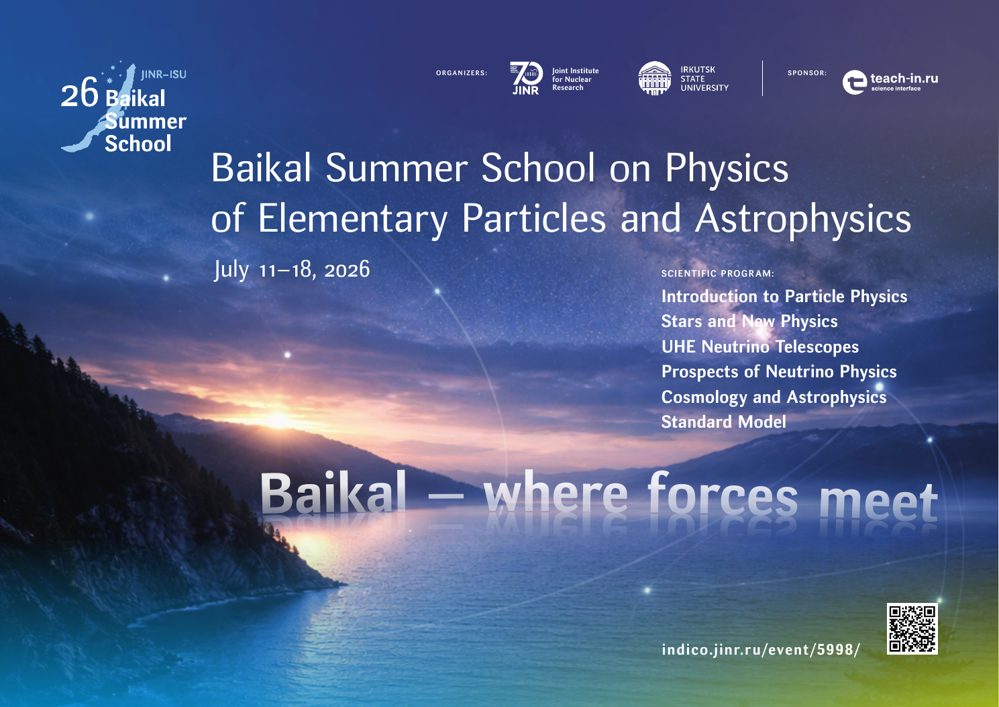

```{=html}
<div class="lecture-catalog">
  <p class="lecture-catalog-lead">
    Scientific and educational school: students, graduate students, summer schools, and supervised theses.
  </p>

  <section class="lecture-course-list" aria-label="Scientific school and community">
    <details class="lecture-course">
      <summary>
        <span class="lecture-course-status">Supervision</span>
        <span class="lecture-course-title">Students and graduate students</span>
      </summary>
      <div class="lecture-course-body">
        <p>Diploma, master, bachelor, coursework, and PhD theses supervised by Dmitry Naumov. Most PDFs are in Russian.</p>
        <div class="thesis-stats" data-student-thesis-stats>
  <span><strong data-thesis-count="total">0</strong> works total</span>
  <span><strong data-thesis-count="phd">0</strong> PhD dissertations</span>
  <span><strong data-thesis-count="master">0</strong> master theses</span>
  <span><strong data-thesis-count="bachelor">0</strong> bachelor theses</span>
  <span><strong data-thesis-count="diploma">0</strong> diploma theses</span>
</div>

<div class="thesis-list thesis-list-supervised">
  <details class="thesis-row" data-thesis-category="diploma">
    <summary><span class="thesis-year">2000</span><span class="thesis-author">D. V. Kustov</span><span class="thesis-type">Diploma thesis</span></summary>
    <div class="thesis-body"><p>Polarization of Lambda hyperons in the NOMAD experiment.</p><a class="thesis-link" href="../students/theses/kustov.pdf">PDF</a></div>
  </details>
  <details class="thesis-row" data-thesis-category="diploma">
    <summary><span class="thesis-year">2000</span><span class="thesis-author">Artem V. Chukanov</span><span class="thesis-type">Diploma thesis</span></summary>
    <div class="thesis-body"><p>Measurement of Λ and Λ-bar hyperon polarization in charged-current neutrino and antineutrino interactions in NOMAD.</p><a class="thesis-link" href="../students/theses/chukanov_diplom.pdf">PDF</a></div>
  </details>
  <details class="thesis-row" data-thesis-category="diploma">
    <summary><span class="thesis-year">2002</span><span class="thesis-author">Vladimir V. Lyubushkin</span><span class="thesis-type">Diploma thesis</span></summary>
    <div class="thesis-body"><p>Selection of quasi-elastic scattering events in the NOMAD experiment at CERN.</p><a class="thesis-link" href="../students/theses/lyubushkin.pdf">PDF</a></div>
  </details>
  <details class="thesis-row" data-thesis-category="diploma">
    <summary><span class="thesis-year">2004</span><span class="thesis-author">Oleg B. Samoylov</span><span class="thesis-type">Diploma thesis</span></summary>
    <div class="thesis-body"><p>Search for the strange exotic baryon resonance θ<sup>+</sup>(1530) in the NOMAD experiment at CERN.</p><a class="thesis-link" href="../students/theses/samoylov_diploma.pdf">PDF</a></div>
  </details>
  <details class="thesis-row" data-thesis-category="phd">
    <summary><span class="thesis-year">2006</span><span class="thesis-author">Artem V. Chukanov</span><span class="thesis-type">PhD dissertation</span></summary>
    <div class="thesis-body"><p>Fragmentation effects in strange-hadron neutrinoproduction in the NOMAD experiment at CERN.</p><a class="thesis-link" href="../students/theses/chukanov_phd_thesis.pdf">PDF</a></div>
  </details>
  <details class="thesis-row" data-thesis-category="diploma">
    <summary><span class="thesis-year">2007</span><span class="thesis-author">Andrey S. Sheshukov</span><span class="thesis-type">Diploma thesis</span></summary>
    <div class="thesis-body"><p>Simulation and reconstruction in the emulsion detector of the OPERA experiment.</p><a class="thesis-link" href="../students/theses/sheshukov.pdf">PDF</a></div>
  </details>
  <details class="thesis-row" data-thesis-category="diploma">
    <summary><span class="thesis-year">2007</span><span class="thesis-author">Maxim O. Gonchar</span><span class="thesis-type">Diploma thesis</span></summary>
    <div class="thesis-body"><p>Study of a plastic-scintillator trigger system for the Daya Bay experiment.</p><a class="thesis-link" href="../students/theses/gonchar_diploma.pdf">PDF</a></div>
  </details>
  <details class="thesis-row" data-thesis-category="diploma">
    <summary><span class="thesis-year">2007</span><span class="thesis-author">Svetlana V. Biktemerova</span><span class="thesis-type">Diploma thesis</span></summary>
    <div class="thesis-body"><p>Simulation and reconstruction in the NUKLON experiment.</p><a class="thesis-link" href="../students/theses/biktemerova_diplom.pdf">PDF</a></div>
  </details>
  <details class="thesis-row" data-thesis-category="diploma">
    <summary><span class="thesis-year">2008</span><span class="thesis-author">Vyacheslav A. Li</span><span class="thesis-type">Diploma thesis</span></summary>
    <div class="thesis-body"><p>Neutrino oscillations within quantum field theory.</p><a class="thesis-link" href="../students/theses/lee.pdf">PDF</a></div>
  </details>
  <details class="thesis-row" data-thesis-category="diploma">
    <summary><span class="thesis-year">2010</span><span class="thesis-author">Irina V. Potapova</span><span class="thesis-type">Diploma thesis</span></summary>
    <div class="thesis-body"><p>Neutrino oscillations in matter within quantum field theory.</p><a class="thesis-link" href="../students/theses/potapova.pdf">PDF</a></div>
  </details>
  <details class="thesis-row" data-thesis-category="diploma">
    <summary><span class="thesis-year">2011</span><span class="thesis-author">Varvara S. Batozskaya</span><span class="thesis-type">Diploma thesis</span></summary>
    <div class="thesis-body"><p>Cosmological neutrinos.</p><a class="thesis-link" href="../students/theses/batozskaya.pdf">PDF</a></div>
  </details>
  <details class="thesis-row" data-thesis-category="phd">
    <summary><span class="thesis-year">2011</span><span class="thesis-author">Oleg B. Samoylov</span><span class="thesis-type">PhD dissertation</span></summary>
    <div class="thesis-body"><p>Charm-quark production cross section and an estimate of the possible pentaquark Θ<sup>+</sup> in neutrino interactions in NOMAD.</p><a class="thesis-link" href="../students/theses/samoylov_phd_thesis.pdf">PDF</a></div>
  </details>
  <details class="thesis-row" data-thesis-category="diploma">
    <summary><span class="thesis-year">2014</span><span class="thesis-author">Dmitry V. Taychenachev</span><span class="thesis-type">Diploma thesis</span></summary>
    <div class="thesis-body"><p>Determination of the neutrino mass hierarchy in reactor and accelerator neutrino experiments.</p><a class="thesis-link" href="../students/theses/tayachenachev.pdf">PDF</a></div>
  </details>
  <details class="thesis-row" data-thesis-category="diploma">
    <summary><span class="thesis-year">2015</span><span class="thesis-author">Konstantin A. Treskov</span><span class="thesis-type">Diploma thesis</span></summary>
    <div class="thesis-body"><p>Neutrino oscillations in matter and the possibility of studying decoherence in solar experiments.</p><a class="thesis-link" href="../students/theses/treskov.pdf">PDF</a></div>
  </details>
  <details class="thesis-row" data-thesis-category="phd">
    <summary><span class="thesis-year">2017</span><span class="thesis-author">Maxim O. Gonchar</span><span class="thesis-type">PhD dissertation</span></summary>
    <div class="thesis-body"><p>Measurement of θ<sub>13</sub> and Δm<sup>2</sup><sub>32</sub> in the Daya Bay experiment.</p><a class="thesis-link" href="../students/theses/gonchar_phd_thesis.pdf">PDF</a></div>
  </details>
  <details class="thesis-row" data-thesis-category="bachelor">
    <summary><span class="thesis-year">2022</span><span class="thesis-author">Sergey I. Zavyalov</span><span class="thesis-type">Bachelor thesis</span></summary>
    <div class="thesis-body"><p>Simulation of atmospheric-neutrino fluxes in the Baikal-GVD experiment.</p></div>
  </details>
  <details class="thesis-row" data-thesis-category="master">
    <summary><span class="thesis-year">2022</span><span class="thesis-author">Alisa R. Didenko</span><span class="thesis-type">Master thesis</span></summary>
    <div class="thesis-body"><p>Application of machine learning to the analysis of Higgs-boson production in association with a top quark.</p></div>
  </details>
  <details class="thesis-row" data-thesis-category="bachelor">
    <summary><span class="thesis-year">2023</span><span class="thesis-author">Petr I. Lensky</span><span class="thesis-type">Bachelor thesis</span></summary>
    <div class="thesis-body"><p>Determination of the time and coordinates of particle interactions using the optical system of the DUNE near liquid-argon detector.</p></div>
  </details>
  <details class="thesis-row" data-thesis-category="diploma">
    <summary><span class="thesis-year">2024</span><span class="thesis-author">V. I. Zhavoronkova</span><span class="thesis-type">Diploma thesis</span></summary>
    <div class="thesis-body"><p>Application of machine-learning methods to estimate Cherenkov-radiation fluxes in the Baikal-GVD experiment.</p></div>
  </details>
  <details class="thesis-row" data-thesis-category="master">
    <summary><span class="thesis-year">2024</span><span class="thesis-author">Sergey I. Zavyalov</span><span class="thesis-type">Master thesis</span></summary>
    <div class="thesis-body"><p>Development of the <a href="https://pypi.org/project/ntsim/">NTSim</a> package for neutrino telescope simulation and efficiency estimates for Baikal-GVD neutrino event registration.</p><a class="thesis-link" href="../students/theses/zavyalov_diploma.pdf">PDF</a></div>
  </details>
  <details class="thesis-row" data-thesis-category="master">
    <summary><span class="thesis-year">2025</span><span class="thesis-author">Petr I. Lensky</span><span class="thesis-type">Master thesis</span></summary>
    <div class="thesis-body"><p>Determination of optical-system characteristics for the DUNE near liquid-argon detector.</p></div>
  </details>
  <details class="thesis-row" data-thesis-category="coursework">
    <summary><span class="thesis-year">2025</span><span class="thesis-author">Maxim B. Kovalev</span><span class="thesis-type">Coursework</span></summary>
    <div class="thesis-body"><p>Finding analogues of neutrino oscillations in matter in classical physics.</p><a class="thesis-link" href="../students/theses/kovalev.pdf">PDF</a></div>
  </details>
  <details class="thesis-row" data-thesis-category="phd">
    <summary><span class="thesis-year">2026</span><span class="thesis-author">Vladimir A. Allakhverdyan</span><span class="thesis-type">PhD dissertation</span></summary>
    <div class="thesis-body"><p>Transport of electromagnetic radiation and neutrinos in modeling the response of a neutrino telescope.</p><a class="thesis-link" href="../students/theses/allaxwerdian.pdf">PDF</a></div>
  </details>
  <details class="thesis-row" data-thesis-category="master">
    <summary><span class="thesis-year">2026</span><span class="thesis-author">Nikita S. Borodin</span><span class="thesis-type">Master thesis</span></summary>
    <div class="thesis-body"><p>Spin-orbit effects in decays of (pseudo)scalar particles and diffraction of twisted quantum states.</p><a class="thesis-link" href="../students/theses/Borodin_dissertation.pdf">PDF</a></div>
  </details>
</div>
<script src="../assets/students-stats.js"></script>
      </div>
    </details>

    <details class="lecture-course school-course-baikal" id="baikal-school">
      <summary>
        <span class="lecture-course-status">2 events, program</span>
        <span class="lecture-course-title">Baikal Summer School on Physics of Elementary Particles and Astrophysics</span>
      </summary>
      <div class="lecture-course-body">
        <p>Baikal summer school on particle physics and astrophysics.</p>
        <div class="lecture-material-list">
          <details class="lecture-material" id="baikal-school-2026">
            <summary>2026</summary>
            <div class="lecture-material-body">

<div class="lecture-course-actions">
  <a class="lecture-action-primary" href="https://indico.jinr.ru/event/5998/">School page</a>
  <a href="baikal-school-2026-projects.html">Projects</a>
  <a href="../assets/schools/baikal-2026/baikal-school-2026-program.pdf">Program</a>
  <a href="../assets/schools/baikal-2026/baikal-school-2026-poster.pdf">Poster</a>
  <a href="https://disk.jinr.ru/index.php/s/dPLtxmpxcSWAzaK?dir=/Baikal_summer_school/Baikal_Summer_School_2026/Materials">Materials</a>
  <a href="https://disk.jinr.ru/index.php/s/dPLtxmpxcSWAzaK?dir=/Baikal_summer_school/Baikal_Summer_School_2026">Photo archive</a>
</div>

<div class="baikal-school-poster">
  <a href="../assets/schools/baikal-2026/baikal-school-2026-poster.pdf">
    
  </a>
</div>
              <div class="baikal-school-program-card">
                <div class="baikal-lecture-index" aria-label="Baikal School 2026 lectures">
                  <div class="baikal-lecturer-row"><h4 class="baikal-lecturer-name">Dmitry Naumov</h4><ul class="baikal-talk-list"><li><a class="baikal-talk-title" href="../particlephysics/IntroParticlePhysicsBaikal/index.html">Introduction to Particle Physics I-II</a></li></ul></div>
                  <div class="baikal-lecturer-row"><h4 class="baikal-lecturer-name">Zhi-zhong Xing</h4><ul class="baikal-talk-list"><li><span class="baikal-talk-title baikal-talk-title-muted">Origin of neutrino mass and mixing I (<a href="https://disk.jinr.ru/public.php/dav/files/dPLtxmpxcSWAzaK/Baikal_summer_school/Baikal_Summer_School_2026/Materials/Zhi-zhong%20Xing%20%28I%29.ppt">ppt</a>, <a href="https://disk.jinr.ru/public.php/dav/files/dPLtxmpxcSWAzaK/Baikal_summer_school/Baikal_Summer_School_2026/Materials/Zhi-zhong%20Xing%20%28I%29.pdf">pdf</a>), II (<a href="https://disk.jinr.ru/public.php/dav/files/dPLtxmpxcSWAzaK/Baikal_summer_school/Baikal_Summer_School_2026/Materials/Zhi-zhong%20Xing%20%28II%29.ppt">ppt</a>, <a href="https://disk.jinr.ru/public.php/dav/files/dPLtxmpxcSWAzaK/Baikal_summer_school/Baikal_Summer_School_2026/Materials/Zhi-zhong%20Xing%20%28II%29.pdf">pdf</a>)</span></li></ul></div>
                  <div class="baikal-lecturer-row"><h4 class="baikal-lecturer-name">Dmitry Gorbunov</h4><ul class="baikal-talk-list"><li><span class="baikal-talk-title baikal-talk-title-muted">Cosmology I (<a href="https://disk.jinr.ru/public.php/dav/files/dPLtxmpxcSWAzaK/Baikal_summer_school/Baikal_Summer_School_2026/Materials/Dmitry%20Gorbunov%20%28I%29.pdf">pdf</a>), II (<a href="https://disk.jinr.ru/public.php/dav/files/dPLtxmpxcSWAzaK/Baikal_summer_school/Baikal_Summer_School_2026/Materials/Dmitry%20Gorbunov%20%28II%29_v1.pdf">pdf</a>)</span></li></ul></div>
                  <div class="baikal-lecturer-row"><h4 class="baikal-lecturer-name">Liangjian Wen</h4><ul class="baikal-talk-list"><li><span class="baikal-talk-title baikal-talk-title-muted">Prospects of neutrino physics I (<a href="https://disk.jinr.ru/public.php/dav/files/dPLtxmpxcSWAzaK/Baikal_summer_school/Baikal_Summer_School_2026/Materials/Liangjian%20Wen%20%28I%29.pptx">pptx</a>), II (<a href="https://disk.jinr.ru/public.php/dav/files/dPLtxmpxcSWAzaK/Baikal_summer_school/Baikal_Summer_School_2026/Materials/Liangjian%20Wen%20%28II%29.pptx">pptx</a>)</span></li></ul></div>
                  <div class="baikal-lecturer-row"><h4 class="baikal-lecturer-name">Junting Huang</h4><ul class="baikal-talk-list"><li><span class="baikal-talk-title baikal-talk-title-muted">Introduction to dark matter (<a href="https://disk.jinr.ru/public.php/dav/files/dPLtxmpxcSWAzaK/Baikal_summer_school/Baikal_Summer_School_2026/Materials/Junting%20Huang_v1.pptx">pptx</a>)</span></li></ul></div>
                  <div class="baikal-lecturer-row"><h4 class="baikal-lecturer-name">Andrey Sheshukov</h4><ul class="baikal-talk-list"><li><span class="baikal-talk-title baikal-talk-title-muted">Simulation Software I-II</span></li></ul></div>
                  <div class="baikal-lecturer-row"><h4 class="baikal-lecturer-name">Emil T. Akhmedov</h4><ul class="baikal-talk-list"><li><span class="baikal-talk-title baikal-talk-title-muted">Gravity, Black Holes and all that I-II</span></li></ul></div>
                  <div class="baikal-lecturer-row"><h4 class="baikal-lecturer-name">Sergey Troitsky</h4><ul class="baikal-talk-list"><li><span class="baikal-talk-title baikal-talk-title-muted">Stars and new physics I (<a href="https://disk.jinr.ru/public.php/dav/files/dPLtxmpxcSWAzaK/Baikal_summer_school/Baikal_Summer_School_2026/Materials/Sergey%20Troitsky%20%28I%29.pdf">pdf</a>), II (<a href="https://disk.jinr.ru/public.php/dav/files/dPLtxmpxcSWAzaK/Baikal_summer_school/Baikal_Summer_School_2026/Materials/Sergey%20Troitsky%20%28II%29.pdf">pdf</a>)</span></li></ul></div>
                  <div class="baikal-lecturer-row"><h4 class="baikal-lecturer-name">Grigory Safronov</h4><ul class="baikal-talk-list"><li><span class="baikal-talk-title baikal-talk-title-muted">UHE Neutrino Telescopes I (<a href="https://disk.jinr.ru/public.php/dav/files/dPLtxmpxcSWAzaK/Baikal_summer_school/Baikal_Summer_School_2026/Materials/Grigory%20Safronov%20%28I%29.pptx">pptx</a>, <a href="https://disk.jinr.ru/public.php/dav/files/dPLtxmpxcSWAzaK/Baikal_summer_school/Baikal_Summer_School_2026/Materials/Grigory%20Safronov%20%28I%29.pdf">pdf</a>), II (<a href="https://disk.jinr.ru/public.php/dav/files/dPLtxmpxcSWAzaK/Baikal_summer_school/Baikal_Summer_School_2026/Materials/Grigory%20Safronov%20%28II%29.pdf">pdf</a>)</span></li></ul></div>
                  <div class="baikal-lecturer-row"><h4 class="baikal-lecturer-name">Dmitry Bylinkin</h4><ul class="baikal-talk-list"><li><span class="baikal-talk-title baikal-talk-title-muted">Special evening lecture / discussion (<a href="https://disk.jinr.ru/public.php/dav/files/dPLtxmpxcSWAzaK/Baikal_summer_school/Baikal_Summer_School_2026/Materials/Dmitry%20Bylinkin.pdf">pdf</a>)</span></li></ul></div>
                  <div class="baikal-lecturer-row"><h4 class="baikal-lecturer-name">Dmitry Karlovets</h4><ul class="baikal-talk-list"><li><span class="baikal-talk-title baikal-talk-title-muted">Vortex states (<a href="https://disk.jinr.ru/public.php/dav/files/dPLtxmpxcSWAzaK/Baikal_summer_school/Baikal_Summer_School_2026/Materials/Dmitry%20Karlovets.pptx">pptx</a>)</span></li></ul></div>
                  <div class="baikal-lecturer-row"><h4 class="baikal-lecturer-name">Maxim Barkov</h4><ul class="baikal-talk-list"><li><span class="baikal-talk-title baikal-talk-title-muted">How to make jets fast, powerful and variable (<a href="https://disk.jinr.ru/public.php/dav/files/dPLtxmpxcSWAzaK/Baikal_summer_school/Baikal_Summer_School_2026/Materials/Maxim%20Barkov.pptx">pptx</a>)</span></li></ul></div>
                  <div class="baikal-lecturer-row"><h4 class="baikal-lecturer-name">Elena Nokhrina</h4><ul class="baikal-talk-list"><li><span class="baikal-talk-title baikal-talk-title-muted">Magnetic fields in AGN jets (<a href="https://disk.jinr.ru/public.php/dav/files/dPLtxmpxcSWAzaK/Baikal_summer_school/Baikal_Summer_School_2026/Materials/Elena%20Nokhrina.pdf">pdf</a>)</span></li></ul></div>
                  <div class="baikal-lecturer-row"><h4 class="baikal-lecturer-name">Evgeny Derishev</h4><ul class="baikal-talk-list"><li><span class="baikal-talk-title baikal-talk-title-muted">Radiation and particle acceleration processes in relativistic outflows I (<a href="https://disk.jinr.ru/public.php/dav/files/dPLtxmpxcSWAzaK/Baikal_summer_school/Baikal_Summer_School_2026/Materials/Engeny%20Derishev%20%28I%29.pdf">pdf</a>), II (<a href="https://disk.jinr.ru/public.php/dav/files/dPLtxmpxcSWAzaK/Baikal_summer_school/Baikal_Summer_School_2026/Materials/Engeny%20Derishev%20%28II%29.pdf">pdf</a>); Bz patch movie (<a href="https://disk.jinr.ru/public.php/dav/files/dPLtxmpxcSWAzaK/Baikal_summer_school/Baikal_Summer_School_2026/Materials/DER_Bz_patch_movie.avi">avi</a>, <a href="https://disk.jinr.ru/public.php/dav/files/dPLtxmpxcSWAzaK/Baikal_summer_school/Baikal_Summer_School_2026/Materials/DER_Bz_patch_movie.mp4">mp4</a>)</span></li></ul></div>
                  <div class="baikal-lecturer-row">
                    <h4 class="baikal-lecturer-name">Projects</h4>
                    <ul class="baikal-talk-list baikal-student-materials">
                      <li><a class="baikal-talk-title" href="https://disk.jinr.ru/public.php/dav/files/dPLtxmpxcSWAzaK/Baikal_summer_school/Baikal_Summer_School_2026/Materials/Projects/1st%20Group.pptx">High-Energy Astrophysical Neutrinos</a> <span class="baikal-talk-title-muted">(<a href="https://disk.jinr.ru/public.php/dav/files/dPLtxmpxcSWAzaK/Baikal_summer_school/Baikal_Summer_School_2026/Materials/Projects/1st%20Group.pptx">pptx</a>)</span><p class="baikal-student-meta"><strong>Group members:</strong> Vladimir Sverkunov, Anastasia Andreeva, Vladimir Astakhov, Sofija Murzakova, Evgeny Bobrov, David Nkundumukiza, Kirill Kudayev. <strong>Supervisor:</strong> Andrey Radjabov. <strong>Project author:</strong> Vladimir Allakhverdian.</p></li>
                      <li><a class="baikal-talk-title" href="https://disk.jinr.ru/public.php/dav/files/dPLtxmpxcSWAzaK/Baikal_summer_school/Baikal_Summer_School_2026/Materials/Projects/Particle_Acceleration_at_Astrophysical_Shocks%20%281%29.pdf">Particle Acceleration at Astrophysical Shocks</a> <span class="baikal-talk-title-muted">(<a href="https://disk.jinr.ru/public.php/dav/files/dPLtxmpxcSWAzaK/Baikal_summer_school/Baikal_Summer_School_2026/Materials/Projects/Particle_Acceleration_at_Astrophysical_Shocks%20%281%29.pdf">pdf</a>)</span><p class="baikal-student-meta"><strong>Group members:</strong> Fedor Baykov, Sergey Serga, Alexandra Panfiorova, Sardor Islamov, Matvey Klimenko, Artem Konovalov, Alexander Kuzmichev. <strong>Supervisor:</strong> Evgeny Derishev. <strong>Project author:</strong> Prof. Evgeny Derishev.</p></li>
                      <li><a class="baikal-talk-title" href="https://disk.jinr.ru/public.php/dav/files/dPLtxmpxcSWAzaK/Baikal_summer_school/Baikal_Summer_School_2026/Materials/Projects/Group3.%20Neutrino%20oscillations%20in%20matter.pdf">Neutrino oscillations in matter</a> <span class="baikal-talk-title-muted">(<a href="https://disk.jinr.ru/public.php/dav/files/dPLtxmpxcSWAzaK/Baikal_summer_school/Baikal_Summer_School_2026/Materials/Projects/Group3.%20Neutrino%20oscillations%20in%20matter.pdf">pdf</a>)</span><p class="baikal-student-meta"><strong>Group members:</strong> Ekaterina Tyapkina, Julia Vdovina, Sofia Frank-Kamenetskaya, Daniel Kharlamov, Georgy Chachava, Stepan Cherepanov, Alexander Shchepkin. <strong>Supervisor:</strong> Vladimir Allakhverdian. <strong>Project author:</strong> Vladimir Allakhverdian.</p></li>
                      <li><a class="baikal-talk-title" href="https://disk.jinr.ru/public.php/dav/files/dPLtxmpxcSWAzaK/Baikal_summer_school/Baikal_Summer_School_2026/Materials/Projects/Neutrino%20Emission%20from%20NGC%201068-like%20Seyfert%20Galaxies%20and%20KM3NeTARCA%20Detectability.pdf">Neutrino Emission from NGC 1068-like Seyfert Galaxies and KM3NeT/ARCA Detectability</a> <span class="baikal-talk-title-muted">(<a href="https://disk.jinr.ru/public.php/dav/files/dPLtxmpxcSWAzaK/Baikal_summer_school/Baikal_Summer_School_2026/Materials/Projects/Neutrino%20Emission%20from%20NGC%201068-like%20Seyfert%20Galaxies%20and%20KM3NeTARCA%20Detectability.pdf">pdf</a>)</span><p class="baikal-student-meta"><strong>Group members:</strong> Lijun Tong, Zike Wang, Yifan Jiang, Shasha Liu, Lili Yang, Haoyan Zhang, Zhaozhi Zhang. <strong>Supervisor:</strong> Junting Huang. <strong>Project author:</strong> Prof. Lili Yang.</p></li>
                      <li><a class="baikal-talk-title" href="https://disk.jinr.ru/public.php/dav/files/dPLtxmpxcSWAzaK/Baikal_summer_school/Baikal_Summer_School_2026/Materials/Projects/BaikalSchool2026_group5-1.pdf">Unveiling the Quantum Features of Cherenkov Emission: From Momentum Space to Phase Space</a> <span class="baikal-talk-title-muted">(<a href="https://disk.jinr.ru/public.php/dav/files/dPLtxmpxcSWAzaK/Baikal_summer_school/Baikal_Summer_School_2026/Materials/Projects/BaikalSchool2026_group5-1.pdf">pdf</a>)</span><p class="baikal-student-meta"><strong>Group members:</strong> Anastasia Artamonova, Aleksandra Usoltseva, Yurii Akberov, Daniil Akhmedyanov, Daniil Dekabryov, Igor Popov. <strong>Supervisors:</strong> Simon Sotirov, Andrey Sheshukov. <strong>Project author:</strong> Alexander Schepkin.</p></li>
                      <li><span class="baikal-talk-title baikal-talk-title-muted">Hawking Radiation and Primordial Black Holes (<a href="https://disk.jinr.ru/public.php/dav/files/dPLtxmpxcSWAzaK/Baikal_summer_school/Baikal_Summer_School_2026/Materials/Projects/hawking.pptx">pptx</a>, <a href="https://disk.jinr.ru/public.php/dav/files/dPLtxmpxcSWAzaK/Baikal_summer_school/Baikal_Summer_School_2026/Materials/Projects/hawking.pdf">pdf</a>)</span><p class="baikal-student-meta"><strong>Group members:</strong> Daniil Zubchenko, Maksim Maksimov, Sergey Sorokin, Mariia Tsuranova, Aisen Nikiforov, Ekaterina Khabarova, Alexey Kudashov, Ivan Maslakov. <strong>Supervisors:</strong> Emil Akhmedov, Vladimir Lapushkin. <strong>Project author:</strong> Prof. Dmitry Naumov.</p></li>
                      <li><a class="baikal-talk-title" href="https://disk.jinr.ru/public.php/dav/files/dPLtxmpxcSWAzaK/Baikal_summer_school/Baikal_Summer_School_2026/Materials/Projects/group7.pdf">Pulsar Wind Nebula Guitar and Its Environment</a> <span class="baikal-talk-title-muted">(<a href="https://disk.jinr.ru/public.php/dav/files/dPLtxmpxcSWAzaK/Baikal_summer_school/Baikal_Summer_School_2026/Materials/Projects/group7.pdf">pdf</a>)</span><p class="baikal-student-meta"><strong>Group members:</strong> Ozoda Inoyatillo, Polina Medvedeva, Darya Busel, Maxim Tadei, Dashdamir Raqimov, Pavel Kislitsyn, Vladislav Filippov. <strong>Supervisor:</strong> Maxim Barkov. <strong>Project author:</strong> Maxim Barkov.</p></li>
                      <li><a class="baikal-talk-title" href="https://disk.jinr.ru/public.php/dav/files/dPLtxmpxcSWAzaK/Baikal_summer_school/Baikal_Summer_School_2026/Materials/Projects/How_to_observe_wormhole.pptx">How to Observe a Wormhole</a> <span class="baikal-talk-title-muted">(<a href="https://disk.jinr.ru/public.php/dav/files/dPLtxmpxcSWAzaK/Baikal_summer_school/Baikal_Summer_School_2026/Materials/Projects/How_to_observe_wormhole.pptx">pptx</a>)</span><p class="baikal-student-meta"><strong>Group members:</strong> Maxim Krestiyanskikh, Valery Lavrenenko, Anton Murtazin, Polina Batrakova, Anna Dembitskaia, Valeria Dybova, Konstantin Prokopev. <strong>Supervisor:</strong> Sergey Troitsky. <strong>Project author:</strong> Prof. Dmitry Naumov.</p></li>
                    </ul>
                  </div>
                  <div class="baikal-lecturer-row">
                    <h4 class="baikal-lecturer-name">Posters</h4>
                    <ul class="baikal-talk-list baikal-student-materials">
                      <li><a class="baikal-talk-title" href="https://disk.jinr.ru/public.php/dav/files/dPLtxmpxcSWAzaK/Baikal_summer_school/Baikal_Summer_School_2026/Materials/Participant%20reports/Akhmedianov%20D.pdf">Calibration of water-based Cherenkov detector</a> <span class="baikal-talk-title-muted">(<a href="https://disk.jinr.ru/public.php/dav/files/dPLtxmpxcSWAzaK/Baikal_summer_school/Baikal_Summer_School_2026/Materials/Participant%20reports/Akhmedianov%20D.pdf">pdf</a>)</span><p class="baikal-student-meta"><strong>Author:</strong> Akhmedianov D. <strong>Supervisor:</strong> Monkhoev R.</p></li>
                      <li><span class="baikal-talk-title baikal-talk-title-muted">Analysis of the ground temperature as part of the search for an optimal site for the TAIGA-100 astrophysical complex (<a href="https://disk.jinr.ru/public.php/dav/files/dPLtxmpxcSWAzaK/Baikal_summer_school/Baikal_Summer_School_2026/Materials/Participant%20reports/Astakhov%20V.pptx">pptx</a>, <a href="https://disk.jinr.ru/public.php/dav/files/dPLtxmpxcSWAzaK/Baikal_summer_school/Baikal_Summer_School_2026/Materials/Participant%20reports/Astakhov%20V.pdf">pdf</a>)</span><p class="baikal-student-meta"><strong>Author:</strong> Astakhov V.A. <strong>Supervisor:</strong> Ivanova A.L.</p></li>
                      <li><a class="baikal-talk-title" href="https://disk.jinr.ru/public.php/dav/files/dPLtxmpxcSWAzaK/Baikal_summer_school/Baikal_Summer_School_2026/Materials/Participant%20reports/Busel%20D.pdf">Sensitivity of the Baikal-GVD detector to diffuse astrophysical neutrino flux in track-like event analysis</a> <span class="baikal-talk-title-muted">(<a href="https://disk.jinr.ru/public.php/dav/files/dPLtxmpxcSWAzaK/Baikal_summer_school/Baikal_Summer_School_2026/Materials/Participant%20reports/Busel%20D.pdf">pdf</a>)</span><p class="baikal-student-meta"><strong>Authors:</strong> D.A. Busel, G.B. Safronov.</p></li>
                      <li><a class="baikal-talk-title" href="https://disk.jinr.ru/public.php/dav/files/dPLtxmpxcSWAzaK/Baikal_summer_school/Baikal_Summer_School_2026/Materials/Participant%20reports/Chachava%20G.pdf">Searching for heavy neutrinos in e+ e- -&gt; W+ W-</a> <span class="baikal-talk-title-muted">(<a href="https://disk.jinr.ru/public.php/dav/files/dPLtxmpxcSWAzaK/Baikal_summer_school/Baikal_Summer_School_2026/Materials/Participant%20reports/Chachava%20G.pdf">pdf</a>)</span><p class="baikal-student-meta"><strong>Authors:</strong> Chachava G.A., Godunov S.I.</p></li>
                      <li><span class="baikal-talk-title baikal-talk-title-muted">Quantum corrections to the effective potential in SO(N) symmetric scalar field theories in curved spacetime (<a href="https://disk.jinr.ru/public.php/dav/files/dPLtxmpxcSWAzaK/Baikal_summer_school/Baikal_Summer_School_2026/Materials/Participant%20reports/Filippov%20V.pptx">pptx</a>, <a href="https://disk.jinr.ru/public.php/dav/files/dPLtxmpxcSWAzaK/Baikal_summer_school/Baikal_Summer_School_2026/Materials/Participant%20reports/Filippov%20V.pdf">pdf</a>)</span><p class="baikal-student-meta"><strong>Authors:</strong> Filippov V.A., Tolkachev D.M., Iakhibbaev R.M.</p></li>
                      <li><a class="baikal-talk-title" href="https://disk.jinr.ru/public.php/dav/files/dPLtxmpxcSWAzaK/Baikal_summer_school/Baikal_Summer_School_2026/Materials/Participant%20reports/Frank-Kamenetskaya%20S.pdf">Pair gravitino production at the LHC</a> <span class="baikal-talk-title-muted">(<a href="https://disk.jinr.ru/public.php/dav/files/dPLtxmpxcSWAzaK/Baikal_summer_school/Baikal_Summer_School_2026/Materials/Participant%20reports/Frank-Kamenetskaya%20S.pdf">pdf</a>)</span><p class="baikal-student-meta"><strong>Authors:</strong> S. Frank-Kamenetskaya, M. Savina.</p></li>
                      <li><a class="baikal-talk-title" href="https://disk.jinr.ru/public.php/dav/files/dPLtxmpxcSWAzaK/Baikal_summer_school/Baikal_Summer_School_2026/Materials/Participant%20reports/Kudashov%20A.pdf">Axion-Electron Coupling Constraints from TRGB Luminosities: Assessing Theoretical Uncertainties</a> <span class="baikal-talk-title-muted">(<a href="https://disk.jinr.ru/public.php/dav/files/dPLtxmpxcSWAzaK/Baikal_summer_school/Baikal_Summer_School_2026/Materials/Participant%20reports/Kudashov%20A.pdf">pdf</a>)</span><p class="baikal-student-meta"><strong>Speaker:</strong> Kudashov A.M. <strong>Authors:</strong> G.A. Gontcharov, A.M. Kudashov, O.S. Ryutina, S.V. Troitsky.</p></li>
                      <li><a class="baikal-talk-title" href="https://disk.jinr.ru/public.php/dav/files/dPLtxmpxcSWAzaK/Baikal_summer_school/Baikal_Summer_School_2026/Materials/Participant%20reports/Lapushkin%20V.pdf">Lessons from the Klein Paradox</a> <span class="baikal-talk-title-muted">(<a href="https://disk.jinr.ru/public.php/dav/files/dPLtxmpxcSWAzaK/Baikal_summer_school/Baikal_Summer_School_2026/Materials/Participant%20reports/Lapushkin%20V.pdf">pdf</a>)</span><p class="baikal-student-meta"><strong>Authors:</strong> E.T. Akhmedov, D.V. Diakonov, V.I. Lapushkin, D.I. Sadekov.</p></li>
                      <li><a class="baikal-talk-title" href="https://disk.jinr.ru/public.php/dav/files/dPLtxmpxcSWAzaK/Baikal_summer_school/Baikal_Summer_School_2026/Materials/Participant%20reports/Maslakov%20I.pdf">The birth of B-boson in hadron collisions. VMD and formfactors</a> <span class="baikal-talk-title-muted">(<a href="https://disk.jinr.ru/public.php/dav/files/dPLtxmpxcSWAzaK/Baikal_summer_school/Baikal_Summer_School_2026/Materials/Participant%20reports/Maslakov%20I.pdf">pdf</a>)</span><p class="baikal-student-meta"><strong>Author:</strong> Ivan Maslakov. <strong>Supervisor:</strong> D.S. Gorbunov.</p></li>
                      <li><span class="baikal-talk-title baikal-talk-title-muted">Sensitivity to supernova neutrino signal in Baikal-GVD (<a href="https://disk.jinr.ru/public.php/dav/files/dPLtxmpxcSWAzaK/Baikal_summer_school/Baikal_Summer_School_2026/Materials/Participant%20reports/Murzakova%20S.pptx">pptx</a>, <a href="https://disk.jinr.ru/public.php/dav/files/dPLtxmpxcSWAzaK/Baikal_summer_school/Baikal_Summer_School_2026/Materials/Participant%20reports/Murzakova%20S.pdf">pdf</a>)</span><p class="baikal-student-meta"><strong>Authors:</strong> Sofia Murzakova, Andrey Sheshukov.</p></li>
                      <li><a class="baikal-talk-title" href="https://disk.jinr.ru/public.php/dav/files/dPLtxmpxcSWAzaK/Baikal_summer_school/Baikal_Summer_School_2026/Materials/Participant%20reports/Nkundumukiza%20D.pdf">A Prototype of the Water Cherenkov Detector in the TAIGA-100 Project</a> <span class="baikal-talk-title-muted">(<a href="https://disk.jinr.ru/public.php/dav/files/dPLtxmpxcSWAzaK/Baikal_summer_school/Baikal_Summer_School_2026/Materials/Participant%20reports/Nkundumukiza%20D.pdf">pdf</a>)</span><p class="baikal-student-meta"><strong>Author:</strong> David Nkundumukiza. <strong>Leader:</strong> Prof. Budnev N.M.</p></li>
                      <li><a class="baikal-talk-title" href="https://disk.jinr.ru/public.php/dav/files/dPLtxmpxcSWAzaK/Baikal_summer_school/Baikal_Summer_School_2026/Materials/Participant%20reports/Panfiorova%20A.pdf">Methods and some results of the search for submicrosecond optical transients with imaging atmospheric Cherenkov telescopes TAIGA-IACT</a> <span class="baikal-talk-title-muted">(<a href="https://disk.jinr.ru/public.php/dav/files/dPLtxmpxcSWAzaK/Baikal_summer_school/Baikal_Summer_School_2026/Materials/Participant%20reports/Panfiorova%20A.pdf">pdf</a>)</span><p class="baikal-student-meta"><strong>Author:</strong> A.T. Panfiorova. <strong>Supervisor:</strong> E.E. Korosteleva.</p></li>
                      <li><a class="baikal-talk-title" href="https://disk.jinr.ru/public.php/dav/files/dPLtxmpxcSWAzaK/Baikal_summer_school/Baikal_Summer_School_2026/Materials/Participant%20reports/Rubtsov%20D.pptx">Study of Luminescent Characteristics of Epishura baikalensis</a> <span class="baikal-talk-title-muted">(<a href="https://disk.jinr.ru/public.php/dav/files/dPLtxmpxcSWAzaK/Baikal_summer_school/Baikal_Summer_School_2026/Materials/Participant%20reports/Rubtsov%20D.pptx">pptx</a>)</span><p class="baikal-student-meta"><strong>Author:</strong> Rubtsov Dmitry Alekseevich. <strong>Supervisor:</strong> Dr. Sci. (Phys.-Math.) V.P. Dresvyansky.</p></li>
                      <li><a class="baikal-talk-title" href="https://disk.jinr.ru/public.php/dav/files/dPLtxmpxcSWAzaK/Baikal_summer_school/Baikal_Summer_School_2026/Materials/Participant%20reports/Shasha%20Liu.pptx">PMT performance with high-voltage boosting base of TRIDENT</a> <span class="baikal-talk-title-muted">(<a href="https://disk.jinr.ru/public.php/dav/files/dPLtxmpxcSWAzaK/Baikal_summer_school/Baikal_Summer_School_2026/Materials/Participant%20reports/Shasha%20Liu.pptx">pptx</a>)</span><p class="baikal-student-meta"><strong>Author:</strong> Shasha Liu.</p></li>
                      <li><a class="baikal-talk-title" href="https://disk.jinr.ru/public.php/dav/files/dPLtxmpxcSWAzaK/Baikal_summer_school/Baikal_Summer_School_2026/Materials/Participant%20reports/Sotirov%20S.pdf">Galactic neutrinos. Case of nearby PeVatron.</a> <span class="baikal-talk-title-muted">(<a href="https://disk.jinr.ru/public.php/dav/files/dPLtxmpxcSWAzaK/Baikal_summer_school/Baikal_Summer_School_2026/Materials/Participant%20reports/Sotirov%20S.pdf">pdf</a>)</span><p class="baikal-student-meta"><strong>Authors:</strong> A. Korochkin, S. Sotirov, S. Troitsky.</p></li>
                      <li><a class="baikal-talk-title" href="https://disk.jinr.ru/public.php/dav/files/dPLtxmpxcSWAzaK/Baikal_summer_school/Baikal_Summer_School_2026/Materials/Participant%20reports/Sverkunov%20V.pptx">Development of a methodology for cloud analysis based on sky images from a wide-angle camera to search for the TAIGA-100 installation site</a> <span class="baikal-talk-title-muted">(<a href="https://disk.jinr.ru/public.php/dav/files/dPLtxmpxcSWAzaK/Baikal_summer_school/Baikal_Summer_School_2026/Materials/Participant%20reports/Sverkunov%20V.pptx">pptx</a>)</span><p class="baikal-student-meta"><strong>Author:</strong> Vladimir Alexandrovich Sverkunov. <strong>Leaders:</strong> D.P. Zhurov, A.L. Ivanova.</p></li>
                      <li><a class="baikal-talk-title" href="https://disk.jinr.ru/public.php/dav/files/dPLtxmpxcSWAzaK/Baikal_summer_school/Baikal_Summer_School_2026/Materials/Participant%20reports/Usolceva%20A.pdf">Simulation of potential astrophysical neutrino sources in NTSim</a> <span class="baikal-talk-title-muted">(<a href="https://disk.jinr.ru/public.php/dav/files/dPLtxmpxcSWAzaK/Baikal_summer_school/Baikal_Summer_School_2026/Materials/Participant%20reports/Usolceva%20A.pdf">pdf</a>)</span><p class="baikal-student-meta"><strong>Author:</strong> Usolceva Alexandra. <strong>Supervisor:</strong> Andrey Sheshukov.</p></li>
                    </ul>
                  </div>
                </div>
              </div>
            </div>
          </details>
          <details class="lecture-material">
            <summary>2025</summary>
            <div class="lecture-material-body">
              <div class="lecture-course-actions">
                <a href="https://indico.jinr.ru/event/5198/">School page</a>
                <a href="../assets/schools/baikal-2025/baikal-projects-2025.pdf">Projects</a>
              </div>
            </div>
          </details>
        </div>
      </div>
    </details>

    <details class="lecture-course school-course-baksan">
      <summary>
        <span class="lecture-course-status">2 events</span>
        <span class="lecture-course-title">Baksan School</span>
      </summary>
      <div class="lecture-course-body">
        <p>Schools at the Baksan Neutrino Observatory.</p>
        <div class="lecture-course-actions">
          <a class="lecture-action-primary" href="https://indico.inr.ac.ru/event/6/overview">2025 school page</a>
          <a href="http://minus.inr.ac.ru/~school/index1.html">2019 school page</a>
        </div>
      </div>
    </details>
  </section>
</div>
```
