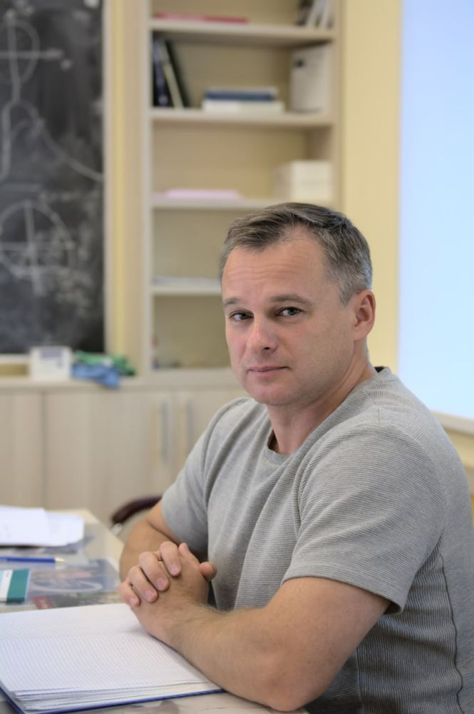

```{=html}
<style>
  .quarto-title-block {
    display: none;
  }
</style>

<section class="home-hero">
  <div class="home-hero-copy">
    <p class="home-eyebrow">NeutrinoHit</p>
    <h1>Наумов Дмитрий Вадимович</h1>
    <p class="home-lead">
      Физик, д. ф.-м. н., преподаватель и автор книг и других материалов по нейтринной физике,
      квантовой теории поля, статистическому анализу, физике элементарных частиц,
      астрофизике и космологии.
    </p>
    <p>Активно занимается научной популяризацией.</p>
    <ul class="home-role-list">
      <li>Заместитель директора Лаборатории ядерных проблем им. В. П. Джелепова ОИЯИ.</li>
      <li>Руководитель Нейтринной программы ОИЯИ.</li>
    </ul>
    <div class="home-actions">
      <a href="https://naumov.jinr.ru/">Профиль JINR</a>
      <a href="https://teach-in.ru/lecturer/naumov-dv">Teach-in</a>
      <a href="https://www.youtube.com/@dmitrynaumov6099/">YouTube</a>
      <a href="https://t.me/NeutrinoHit">Telegram @NeutrinoHit</a>
      <a href="https://t.me/s/NeutrinoHit">Лента TG</a>
      <a href="https://naumov.jinr.ru/download/250">Кандидатская диссертация</a>
      <a href="https://naumov.jinr.ru/download/249">Докторская диссертация</a>
    </div>
  </div>
  
</section>

<section class="home-stats" aria-label="Краткие показатели">
  <div>
    <strong>~200</strong>
    <span>научных работ</span>
  </div>
  <div>
    <strong>&gt;15000</strong>
    <span>цитирований</span>
  </div>
  <div>
    <strong>51</strong>
    <span>индекс Хирша</span>
  </div>
  <div>
    <strong>20+</strong>
    <span>лет преподавания</span>
  </div>
</section>

<section class="home-section">
  <h2>О проекте</h2>
  <p>
    NeutrinoHit — карта моих образовательных, научных и научно-популярных материалов:
    книги, курсы лекций, фотоальбомы, анимации, код, заметки и визуальные истории.
  </p>
</section>

<section class="home-grid">
  <article class="home-panel">
    <h2>Наука</h2>
    <p>
      Участник экспериментов Baikal-GVD, JUNO, Daya Bay, OPERA, NOMAD и EUSO/JEM-EUSO.
      Научные интересы: физика нейтрино, астрофизика и космические лучи, физика элементарных
      частиц, квантовая теория поля и космология.
    </p>
  </article>

  <article class="home-panel">
    <h2>Преподавание</h2>
    <p>
      Курсы и школы по квантовой теории поля, физике нейтрино, статистическому анализу
      и смежным дисциплинам. Под руководством защищены дипломные работы и кандидатские
      диссертации.
    </p>
  </article>

  <article class="home-panel">
    <h2>Книги и научпоп</h2>
    <p>
      Автор учебника «Квантовая теория поля для экспериментаторов и не только»
      и научно-популярной книги «Солнечное нейтрино». Новые книги и курсы постепенно
      собираются здесь.
    </p>
  </article>

  <article class="home-panel">
    <h2>Награды</h2>
    <p>
      Лауреат Breakthrough Prize in Fundamental Physics 2016 и European Physical Society Prize
      2023 в составе коллаборации Daya Bay, а также премий ОИЯИ и ЛЯП ОИЯИ.
    </p>
  </article>
</section>

<section class="home-section">
  <h2>Быстрые разделы</h2>
  <div class="home-link-grid">
    <a href="books.html">Книги</a>
    <a href="lectures.html">Лекции</a>
    <a href="sciencepop.html">Научпоп</a>
    <a href="photos.html">Фото</a>
    <a href="animations.html">Анимации</a>
    <a href="software.html">Код</a>
  </div>
</section>
```
